# FinGear 系統實作架構文件

> **文件類型**：架構設計與實作指導
> **版本**：v1.0
> **最後更新**：2026-01-02
> **配套文件**：[Overview.md](Overview.md), [FunctionalIndicators.md](FunctionalIndicators.md)

## 快速導覽

### 核心模組索引

| 模組                       | 位置      | 說明                             |
| -------------------------- | --------- | -------------------------------- |
| [系統架構總覽](#2-系統架構總覽) | 第 2 章   | 整體架構、數據流、技術棧         |
| [API 客戶端](#31-api-客戶端模組) | 第 3.1 節 | Shioaji API 封裝與錯誤處理       |
| [因子計算引擎](#32-因子計算引擎) | 第 3.2 節 | 7 因子計算邏輯與緩存策略         |
| [選股篩選器](#33-選股篩選器)    | 第 3.3 節 | 三層篩選邏輯與綜合評分模型       |
| [數據管道](#34-數據管道)        | 第 3.4 節 | ETL 流程與 Parquet 分區管理      |
| [自動化腳本](#4-自動化腳本設計) | 第 4 章   | 每日更新、策略掃描、通知推送     |
| [測試與驗證](#5-測試與驗證)     | 第 5 章   | 單元測試、數據驗證、回測框架     |
| [部署與運維](#6-部署與運維)     | 第 6 章   | Docker 容器化、監控、錯誤恢復    |

### 關鍵圖表清單

| 圖表名稱                         | 類型       | 位置        |
| -------------------------------- | ---------- | ----------- |
| 系統整體架構圖                   | Mermaid    | 第 2.1 節   |
| 模組依賴關係圖                   | Mermaid    | 第 2.2 節   |
| 數據流向圖                       | Mermaid    | 第 2.3 節   |
| API 連線時序圖                   | Sequence   | 第 3.1.2 節 |
| 因子計算流程圖                   | Flowchart  | 第 3.2.1 節 |
| 三層篩選狀態機圖                 | State      | 第 3.3.2 節 |
| ETL 管道流程圖                   | Flowchart  | 第 3.4.1 節 |
| 每日更新執行流程圖               | Flowchart  | 第 4.1.1 節 |
| 測試金字塔圖                     | Diagram    | 第 5.1.1 節 |
| 回測流程圖                       | Flowchart  | 第 5.3.1 節 |
| 部署架構圖                       | C4 Model   | 第 6.1 節   |
| 完整類別關係圖（UML）            | Class      | 第 7.1 節   |

---

## 2. 系統架構總覽

### 2.1 整體架構圖

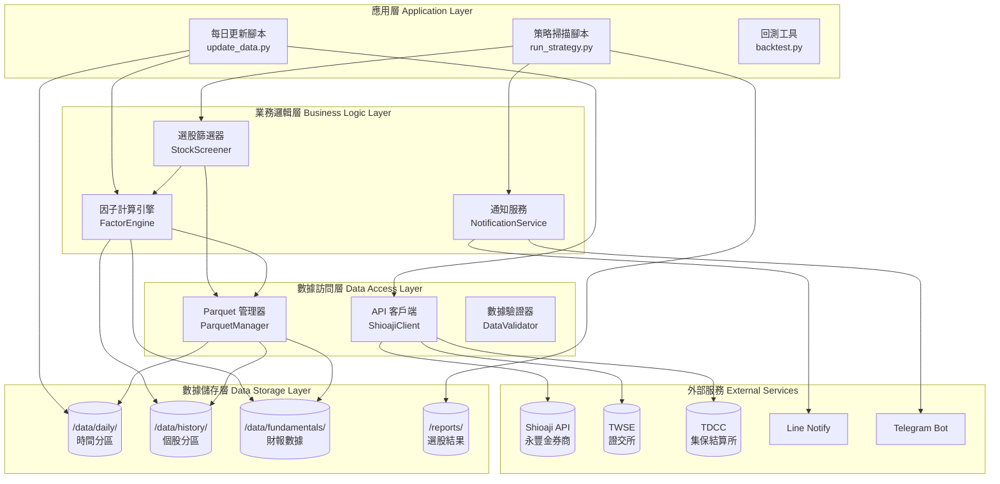

### 2.2 模組依賴關係圖

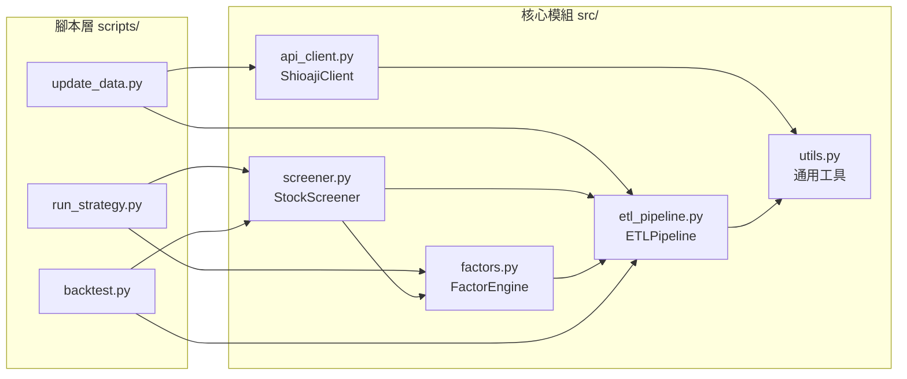

### 2.3 數據流向圖（完整數據生命週期）

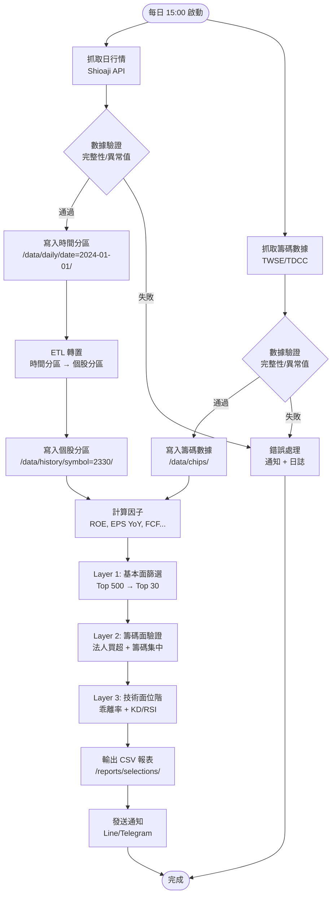

### 2.4 技術棧與設計模式

#### 核心技術棧

| 層級           | 技術選型                        | 版本要求    |
| -------------- | ------------------------------- | ----------- |
| 程式語言       | Python                          | 3.8+        |
| 數據處理       | pandas, numpy                   | Latest      |
| 數據儲存       | Apache Parquet (pyarrow)        | Latest      |
| API 客戶端     | Shioaji SDK                     | Latest      |
| 技術指標計算   | pandas-ta / ta-lib (optional)   | Latest      |
| 排程管理       | schedule                        | Latest      |
| 通知推送       | requests (Line), python-telegram-bot | Latest |
| 測試框架       | pytest, pytest-mock             | Latest      |
| 日誌記錄       | logging (內建)                  | -           |

#### 設計模式應用

| 模組               | 設計模式         | 應用說明                                   |
| ------------------ | ---------------- | ------------------------------------------ |
| ShioajiClient      | Singleton        | 確保 API 連線唯一性，避免重複認證         |
| FactorEngine       | Strategy         | 不同因子計算策略可插拔                     |
| StockScreener      | Pipeline         | 三層篩選以管道模式串接                     |
| ParquetManager     | Repository       | 統一的數據訪問接口，隔離存儲細節           |
| NotificationService| Observer         | 策略結果變化時通知訂閱者                   |
| DataValidator      | Chain of Responsibility | 多個驗證規則鏈式調用               |

---

## 3. 核心模組設計

### 3.1 API 客戶端模組 (api_client.py)

#### 3.1.1 類別架構圖

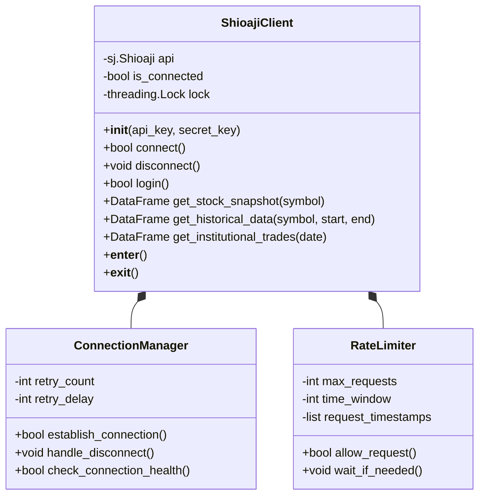

#### 3.1.2 連線與認證時序圖

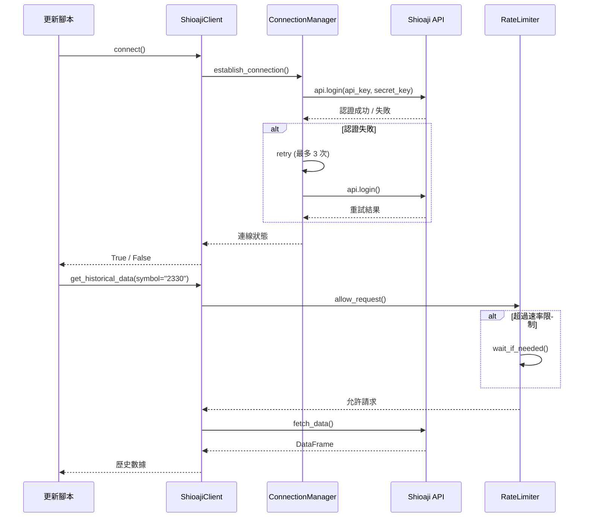

#### 3.1.3 偽代碼：核心方法實作

```python
# 偽代碼：ShioajiClient 核心實作

class ShioajiClient:
    """
    Shioaji API 客戶端封裝

    設計模式：Singleton + Context Manager
    職責：API 連線管理、數據抓取、錯誤處理
    """

    _instance = None  # Singleton 實例

    def __new__(cls, *args, **kwargs):
        """確保單例模式"""
        if cls._instance is None:
            cls._instance = super().__new__(cls)
        return cls._instance

    def __init__(self, api_key: str, secret_key: str):
        """
        初始化 API 客戶端

        參數:
            api_key: 永豐金 API 金鑰
            secret_key: 永豐金密鑰
        """
        if not hasattr(self, 'initialized'):
            self.api_key = api_key
            self.secret_key = secret_key
            self.api = None
            self.is_connected = False
            self.lock = threading.Lock()
            self.rate_limiter = RateLimiter(max_requests=60, time_window=60)
            self.initialized = True

    def connect(self) -> bool:
        """
        建立 API 連線

        返回:
            bool: 連線成功返回 True

        異常:
            ConnectionError: 連線失敗時拋出
        """
        with self.lock:
            if self.is_connected:
                return True

            try:
                # 步驟 1: 初始化 Shioaji API
                self.api = sj.Shioaji()

                # 步驟 2: 登入認證（最多重試 3 次）
                for attempt in range(3):
                    try:
                        self.api.login(
                            api_key=self.api_key,
                            secret_key=self.secret_key
                        )
                        self.is_connected = True
                        logging.info("Shioaji API 連線成功")
                        return True
                    except Exception as e:
                        logging.warning(f"登入失敗 (第 {attempt + 1} 次): {e}")
                        if attempt < 2:
                            time.sleep(5)  # 等待 5 秒後重試
                        else:
                            raise ConnectionError(f"API 登入失敗: {e}")

            except Exception as e:
                logging.error(f"API 連線失敗: {e}")
                self.is_connected = False
                raise

    def get_historical_data(
        self,
        symbol: str,
        start_date: str,
        end_date: str
    ) -> pd.DataFrame:
        """
        取得歷史 K 線數據

        參數:
            symbol: 股票代碼（如 "2330"）
            start_date: 開始日期 ("2024-01-01")
            end_date: 結束日期 ("2024-12-31")

        返回:
            DataFrame: 包含 OHLCV 數據

        欄位:
            date, open, high, low, close, volume
        """
        # 步驟 1: 檢查連線狀態
        if not self.is_connected:
            self.connect()

        # 步驟 2: 速率限制檢查
        self.rate_limiter.wait_if_needed()

        # 步驟 3: 呼叫 API
        try:
            contract = self.api.Contracts.Stocks[symbol]
            kbars = self.api.kbars(
                contract=contract,
                start=start_date,
                end=end_date
            )

            # 步驟 4: 轉換為 DataFrame
            df = pd.DataFrame({
                'date': kbars.ts,
                'open': kbars.Open,
                'high': kbars.High,
                'low': kbars.Low,
                'close': kbars.Close,
                'volume': kbars.Volume
            })

            return df

        except Exception as e:
            logging.error(f"抓取 {symbol} 歷史數據失敗: {e}")
            raise

    def get_institutional_trades(self, date: str) -> pd.DataFrame:
        """
        取得三大法人買賣超數據

        參數:
            date: 日期 ("2024-01-01")

        返回:
            DataFrame: 法人買賣超數據

        欄位:
            symbol, foreign_buy, foreign_sell, foreign_net,
            trust_buy, trust_sell, trust_net,
            dealer_buy, dealer_sell, dealer_net
        """
        # 實作邏輯（類似上述）
        pass

    def __enter__(self):
        """Context Manager 進入"""
        self.connect()
        return self

    def __exit__(self, exc_type, exc_val, exc_tb):
        """Context Manager 退出"""
        if self.api:
            self.api.logout()
            self.is_connected = False
```

#### 3.1.4 錯誤處理機制

```python
# 偽代碼：錯誤處理與重試邏輯

class APIErrorHandler:
    """API 錯誤處理器"""

    @staticmethod
    def retry_on_failure(max_retries=3, delay=5):
        """
        失敗重試裝飾器

        使用範例:
            @APIErrorHandler.retry_on_failure(max_retries=3)
            def fetch_data():
                return api.get_data()
        """
        def decorator(func):
            def wrapper(*args, **kwargs):
                for attempt in range(max_retries):
                    try:
                        return func(*args, **kwargs)
                    except (ConnectionError, TimeoutError) as e:
                        if attempt < max_retries - 1:
                            logging.warning(
                                f"{func.__name__} 失敗 (第 {attempt + 1} 次): {e}"
                            )
                            time.sleep(delay * (attempt + 1))  # 指數退避
                        else:
                            logging.error(f"{func.__name__} 最終失敗: {e}")
                            raise
            return wrapper
        return decorator
```

---

### 3.2 因子計算引擎 (factors.py)

#### 3.2.1 因子計算流程圖

```mermaid
flowchart TD
    START([開始計算因子])

    LOAD_FIN[載入財報數據<br/>/data/fundamentals/]
    LOAD_PRICE[載入價格數據<br/>/data/history/]
    LOAD_CHIPS[載入籌碼數據<br/>/data/chips/]

    START --> LOAD_FIN
    START --> LOAD_PRICE
    START --> LOAD_CHIPS

    LOAD_FIN --> CALC_ROE[計算 ROE<br/>稅後淨利 ÷ 平均股東權益]
    LOAD_FIN --> CALC_MARGIN[計算毛利率趨勢<br/>近 3 季變化]
    LOAD_FIN --> CALC_DEBT[計算負債比率<br/>總負債 ÷ 總資產]
    LOAD_FIN --> CALC_FCF[計算自由現金流<br/>營業現金流 - 資本支出]
    LOAD_FIN --> CALC_REV_YOY[計算營收 YoY<br/>(本期 - 去年同期) ÷ 去年同期]
    LOAD_FIN --> CALC_EPS_YoY[計算 EPS YoY<br/>(本期 - 去年同期) ÷ 去年同期]

    LOAD_PRICE --> CALC_PE[計算 P/E vs 歷史<br/>當前 PE ÷ 歷史中位數]

    CALC_ROE --> SCORE_ROE[評分 ROE<br/>1-5 分]
    CALC_MARGIN --> SCORE_MARGIN[評分毛利率趨勢<br/>1-5 分]
    CALC_DEBT --> SCORE_DEBT[評分負債比率<br/>1-5 分]
    CALC_FCF --> SCORE_FCF[評分 FCF<br/>1-5 分]
    CALC_REV_YOY --> SCORE_REV[評分營收 YoY<br/>1-5 分]
    CALC_EPS_YoY --> SCORE_EPS[評分 EPS YoY<br/>1-5 分]
    CALC_PE --> SCORE_PE[評分 P/E<br/>1-5 分]

    SCORE_ROE --> AGGREGATE[加權聚合<br/>依 config/parameters.yaml]
    SCORE_MARGIN --> AGGREGATE
    SCORE_DEBT --> AGGREGATE
    SCORE_FCF --> AGGREGATE
    SCORE_REV --> AGGREGATE
    SCORE_EPS --> AGGREGATE
    SCORE_PE --> AGGREGATE

    AGGREGATE --> TOTAL_SCORE[基本面總分<br/>0-200 分<br/>PE估值權重30%]
    TOTAL_SCORE --> CACHE[寫入緩存<br/>Redis / 記憶體]
    CACHE --> END([完成])
```

#### 3.2.2 因子權重配置

**當前配置** (2026-01-03 更新，定義於 `config/parameters.yaml`)：

| 因子 | 權重 | 說明 | 評分標準 (1-5分) |
|------|------|------|------------------|
| **PE 相對估值** | **30%** | 當前 PE ÷ 歷史中位數 PE | PE < 0.6倍=5分, 0.6-1.0=4分, 1.0-1.4=3分, 1.4-1.8=2分, >1.8=1分 |
| ROE 股東權益報酬率 | 15% | TTM 稅後淨利 ÷ 平均股東權益 | ROE ≥20%=5分, 15-20%=4分, 10-15%=3分, 5-10%=2分, <5%=1分 |
| EPS 年增率 | 15% | (本季 EPS - 去年同季) ÷ 去年同季 | YoY ≥30%=5分, 15-30%=4分, 0-15%=3分, -10-0%=2分, <-10%=1分 |
| 自由現金流 (FCF) | 10% | 營業現金流 - 資本支出 | FCF > 0=4分, FCF ≤ 0=1分 |
| 毛利率趨勢 | 10% | 最近一季毛利率 vs 去年同季 | 改善 >1.5%=5分, 0.5-1.5%=4分, -0.5-0.5%=3分, -1.5--0.5%=2分, <-1.5%=1分 |
| 營收年增率 | 10% | (本季營收 - 去年同季) ÷ 去年同季 | YoY ≥20%=5分, 10-20%=4分, 0-10%=3分, -5-0%=2分, <-5%=1分 |
| 負債比率 | 10% | 總負債 ÷ 總資產 | 負債比 ≤30%=5分, 30-45%=4分, 45-60%=3分, 60-75%=2分, >75%=1分 |
| **總和** | **100%** | | |

**綜合評分公式**：

```
基本面總分 = (
    ROE評分 × 0.15 +
    EPS_YoY評分 × 0.15 +
    FCF評分 × 0.10 +
    毛利率趨勢評分 × 0.10 +
    營收_YoY評分 × 0.10 +
    負債比率評分 × 0.10 +
    PE相對估值評分 × 0.30  ⭐ 強調估值
) × 40

分數範圍：40-200 分
```

> **設計理念**：30% 的 PE 估值權重確保系統優先選擇低估值標的，降低追高風險。搭配盈利能力 (ROE 15%) 和成長性 (EPS YoY 15%)，形成價值投資導向的選股策略。

#### 3.2.3 七因子實作架構

```python
# 偽代碼：FactorEngine 架構

class FactorEngine:
    """
    因子計算引擎

    職責：計算所有基本面、籌碼面、技術面因子
    設計模式：Strategy Pattern（不同因子策略可插拔）
    """

    def __init__(self, data_manager: ParquetManager):
        """
        初始化因子引擎

        參數:
            data_manager: 數據管理器
        """
        self.data_manager = data_manager
        self.cache = {}  # 因子緩存

        # 註冊因子計算策略
        self.fundamental_factors = {
            'roe': self._calculate_roe,
            'gross_margin_trend': self._calculate_gross_margin_trend,
            'debt_ratio': self._calculate_debt_ratio,
            'fcf': self._calculate_fcf,
            'revenue_yoy': self._calculate_revenue_yoy,
            'eps_yoy': self._calculate_eps_yoy,
            'pe_relative': self._calculate_pe_relative
        }

    def calculate_fundamental_score(self, symbol: str) -> float:
        """
        計算基本面綜合得分

        參數:
            symbol: 股票代碼

        返回:
            float: 0-200 分
        """
        # 步驟 1: 檢查緩存
        cache_key = f"{symbol}_fundamental_{date.today()}"
        if cache_key in self.cache:
            return self.cache[cache_key]

        # 步驟 2: 計算各因子分數
        scores = {}
        for factor_name, calc_func in self.fundamental_factors.items():
            raw_value = calc_func(symbol)
            scores[factor_name] = self._score_factor(factor_name, raw_value)

        # 步驟 3: 加權聚合（從 config/parameters.yaml 讀取）
        # 當前權重配置（2026-01-03 更新）：
        #   - PE 相對估值: 30% (強調估值因子)
        #   - ROE: 15%, EPS YoY: 15%
        #   - FCF/毛利率趨勢/營收YoY/負債比率: 各 10%
        total_score = (
            scores['roe'] * 0.15 +
            scores['eps_yoy'] * 0.15 +
            scores['fcf'] * 0.10 +
            scores['gross_margin_trend'] * 0.10 +
            scores['revenue_yoy'] * 0.10 +
            scores['debt_ratio'] * 0.10 +
            scores['pe_relative'] * 0.30  # ⭐ 強調估值
        ) * 100

        # 步驟 4: 寫入緩存
        self.cache[cache_key] = total_score

        return total_score

    def _calculate_roe(self, symbol: str) -> float:
        """
        計算 ROE（近四季平均）

        公式:
            ROE = 稅後淨利 ÷ 平均股東權益 × 100%

        參數:
            symbol: 股票代碼

        返回:
            float: ROE 百分比
        """
        # 步驟 1: 載入財報數據
        financials = self.data_manager.read_parquet(
            f'/data/fundamentals/quarterly/{symbol}.parquet'
        )

        # 步驟 2: 取得近四季數據
        recent_4q = financials.tail(4)

        # 步驟 3: 計算
        net_income = recent_4q['net_income'].sum()  # 近四季稅後淨利總和
        avg_equity = recent_4q['equity'].mean()     # 平均股東權益

        if avg_equity == 0:
            return 0.0

        roe = (net_income / avg_equity) * 100

        return roe

    def _calculate_eps_yoy(self, symbol: str) -> float:
        """
        計算 EPS 年增率

        公式:
            EPS YoY = (本季 EPS - 去年同季 EPS) ÷ |去年同季 EPS| × 100%

        參數:
            symbol: 股票代碼

        返回:
            float: EPS YoY 百分比
        """
        financials = self.data_manager.read_parquet(
            f'/data/fundamentals/quarterly/{symbol}.parquet'
        )

        # 取得最近一季與去年同季的 EPS
        latest_eps = financials.iloc[-1]['eps']
        yoy_eps = financials.iloc[-5]['eps']  # 去年同季（4 季前）

        if abs(yoy_eps) < 0.01:  # 避免除以零
            return 0.0

        eps_yoy = ((latest_eps - yoy_eps) / abs(yoy_eps)) * 100

        return eps_yoy

    def _calculate_fcf(self, symbol: str) -> float:
        """
        計算自由現金流

        公式:
            FCF = 營業現金流 - 資本支出

        參數:
            symbol: 股票代碼

        返回:
            float: FCF 金額
        """
        financials = self.data_manager.read_parquet(
            f'/data/fundamentals/quarterly/{symbol}.parquet'
        )

        # 取得最近一季數據
        latest = financials.iloc[-1]
        operating_cf = latest['operating_cash_flow']
        capex = latest['capital_expenditure']

        fcf = operating_cf - capex

        return fcf

    def _score_factor(self, factor_name: str, raw_value: float) -> int:
        """
        將因子原始值轉換為 1-5 分

        參數:
            factor_name: 因子名稱
            raw_value: 原始數值

        返回:
            int: 1-5 分
        """
        # 評分規則（根據 Overview.md 的標準）
        scoring_rules = {
            'roe': [
                (15, 5), (10, 4), (5, 3), (0, 2), (-float('inf'), 1)
            ],
            'eps_yoy': [
                (20, 5), (10, 4), (0, 3), (-20, 2), (-float('inf'), 1)
            ],
            'gross_margin_trend': [
                (2, 5), (0, 4), (-2, 3), (-5, 2), (-float('inf'), 1)
            ],
            'debt_ratio': [
                (30, 5), (50, 4), (70, 3), (80, 2), (100, 1)
            ],
            'fcf': [
                (10000, 5), (5000, 4), (0, 3), (-5000, 2), (-float('inf'), 1)
            ],
            'revenue_yoy': [
                (15, 5), (5, 4), (0, 3), (-5, 2), (-float('inf'), 1)
            ],
            'pe_relative': [
                (0.7, 5), (0.9, 4), (1.0, 3), (1.2, 2), (float('inf'), 1)
            ]
        }

        rules = scoring_rules.get(factor_name, [])
        for threshold, score in rules:
            if factor_name == 'debt_ratio':
                # 負債比率越低越好
                if raw_value <= threshold:
                    return score
            elif factor_name == 'pe_relative':
                # PE 相對值越低越好
                if raw_value <= threshold:
                    return score
            else:
                # 其他因子越高越好
                if raw_value >= threshold:
                    return score

        return 1  # 默認最低分
```

---

### 3.3 選股篩選器 (screener.py)

#### 3.3.1 三層篩選流程圖

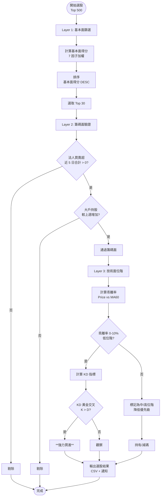

#### 3.3.2 狀態機圖：篩選邏輯

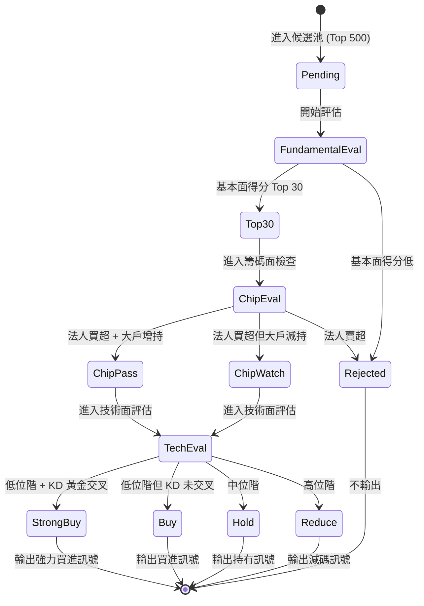

#### 3.3.3 偽代碼：綜合評分模型

```python
# 偽代碼：StockScreener 完整實作

class StockScreener:
    """
    選股篩選器

    職責：三層篩選邏輯、綜合評分、訊號生成
    設計模式：Pipeline Pattern
    """

    def __init__(
        self,
        factor_engine: FactorEngine,
        data_manager: ParquetManager
    ):
        self.factor_engine = factor_engine
        self.data_manager = data_manager
        self.logger = logging.getLogger(__name__)

    def screen_stocks(self, universe: List[str]) -> pd.DataFrame:
        """
        執行完整選股流程

        參數:
            universe: 股票池（如 Top 500 代碼列表）

        返回:
            DataFrame: 選股結果

        欄位:
            symbol, name, fundamental_score, chip_status,
            tech_position, signal, bias_60, kd_cross
        """
        self.logger.info(f"開始選股，候選池: {len(universe)} 檔")

        # Layer 1: 基本面篩選
        top_30 = self._layer1_fundamental_screen(universe)
        self.logger.info(f"Layer 1 完成，篩選出 {len(top_30)} 檔")

        # Layer 2: 籌碼面驗證
        chip_passed = self._layer2_chip_filter(top_30)
        self.logger.info(f"Layer 2 完成，通過 {len(chip_passed)} 檔")

        # Layer 3: 技術面位階判斷
        final_results = self._layer3_technical_position(chip_passed)
        self.logger.info(f"Layer 3 完成，最終 {len(final_results)} 檔")

        return final_results

    def _layer1_fundamental_screen(
        self,
        universe: List[str]
    ) -> pd.DataFrame:
        """
        Layer 1: 基本面篩選

        邏輯:
            1. 計算 7 因子綜合得分
            2. 排序並選取 Top 30

        參數:
            universe: 股票池

        返回:
            DataFrame: Top 30 股票
        """
        scores = []

        for symbol in universe:
            try:
                # 計算基本面得分
                fund_score = self.factor_engine.calculate_fundamental_score(
                    symbol
                )
                scores.append({
                    'symbol': symbol,
                    'fundamental_score': fund_score
                })
            except Exception as e:
                self.logger.warning(f"計算 {symbol} 基本面失敗: {e}")
                continue

        # 轉為 DataFrame 並排序
        df = pd.DataFrame(scores)
        df = df.sort_values('fundamental_score', ascending=False)

        # 取 Top 30
        top_30 = df.head(30).copy()

        return top_30

    def _layer2_chip_filter(
        self,
        candidates: pd.DataFrame
    ) -> pd.DataFrame:
        """
        Layer 2: 籌碼面過濾

        條件:
            ✅ 近 5 日三大法人合計買超 > 0
            ✅ 最近一週大戶持股比例較上週增加

        參數:
            candidates: Layer 1 通過的股票

        返回:
            DataFrame: 通過籌碼面的股票
        """
        passed = []

        for _, row in candidates.iterrows():
            symbol = row['symbol']

            try:
                # 檢查 1: 法人買賣超
                inst_net = self._check_institutional_net(symbol, days=5)

                # 檢查 2: 大戶持股變化
                major_holder_change = self._check_major_holder_change(symbol)

                # 判定
                if inst_net > 0 and major_holder_change > 0:
                    row['chip_status'] = 'pass'
                    row['inst_net_5d'] = inst_net
                    row['major_holder_chg'] = major_holder_change
                    passed.append(row)

            except Exception as e:
                self.logger.warning(f"檢查 {symbol} 籌碼面失敗: {e}")
                continue

        return pd.DataFrame(passed)

    def _layer3_technical_position(
        self,
        candidates: pd.DataFrame
    ) -> pd.DataFrame:
        """
        Layer 3: 技術面位階判斷

        指標:
            - 乖離率（Bias 60）
            - KD 黃金交叉
            - RSI 位置

        訊號生成:
            - 乖離率 0-10% + KD 黃金交叉 → 強力買進
            - 乖離率 10-20% → 順勢加碼
            - 乖離率 > 20% → 減碼

        參數:
            candidates: Layer 2 通過的股票

        返回:
            DataFrame: 最終選股結果（含訊號）
        """
        results = []

        for _, row in candidates.iterrows():
            symbol = row['symbol']

            try:
                # 計算技術指標
                bias_60 = self._calculate_bias(symbol, ma_period=60)
                kd_cross = self._check_kd_cross(symbol)
                rsi_14 = self._calculate_rsi(symbol, period=14)

                # 訊號判斷
                if 0 <= bias_60 <= 10 and kd_cross == 'golden':
                    signal = '強力買進'
                elif 10 < bias_60 <= 20:
                    signal = '順勢加碼'
                elif bias_60 > 20:
                    signal = '減碼'
                else:
                    signal = '觀望'

                # 補充技術面欄位
                row['bias_60'] = bias_60
                row['kd_cross'] = kd_cross
                row['rsi_14'] = rsi_14
                row['signal'] = signal

                results.append(row)

            except Exception as e:
                self.logger.warning(f"計算 {symbol} 技術面失敗: {e}")
                continue

        return pd.DataFrame(results)

    def _calculate_bias(self, symbol: str, ma_period: int = 60) -> float:
        """
        計算乖離率

        公式:
            Bias = (Price - MA) / MA × 100%

        參數:
            symbol: 股票代碼
            ma_period: 均線週期

        返回:
            float: 乖離率百分比
        """
        # 載入價格數據
        price_data = self.data_manager.read_parquet(
            f'/data/history/symbol={symbol}/data.parquet'
        )

        # 計算移動平均線
        price_data[f'ma{ma_period}'] = price_data['close'].rolling(
            window=ma_period
        ).mean()

        # 取得最新數據
        latest = price_data.iloc[-1]
        price = latest['close']
        ma = latest[f'ma{ma_period}']

        if ma == 0:
            return 0.0

        bias = ((price - ma) / ma) * 100

        return bias

    def _check_kd_cross(self, symbol: str) -> str:
        """
        檢查 KD 指標交叉狀態

        返回:
            str: 'golden' (黃金交叉), 'death' (死亡交叉), 'none' (無交叉)
        """
        price_data = self.data_manager.read_parquet(
            f'/data/history/symbol={symbol}/data.parquet'
        )

        # 計算 KD 指標
        # (實際實作應使用 pandas-ta 或 ta-lib)
        k_values = price_data['k']  # 假設已計算
        d_values = price_data['d']

        # 取得最近兩筆數據
        k_today, k_yesterday = k_values.iloc[-1], k_values.iloc[-2]
        d_today, d_yesterday = d_values.iloc[-1], d_values.iloc[-2]

        # 判斷交叉
        if k_yesterday <= d_yesterday and k_today > d_today:
            return 'golden'
        elif k_yesterday >= d_yesterday and k_today < d_today:
            return 'death'
        else:
            return 'none'

    def _check_institutional_net(self, symbol: str, days: int = 5) -> float:
        """
        計算近 N 日法人買賣超合計

        參數:
            symbol: 股票代碼
            days: 天數

        返回:
            float: 法人買賣超合計（張數）
        """
        inst_data = self.data_manager.read_parquet(
            '/data/chips/institutional/data.parquet'
        )

        # 篩選該股票近 N 日數據
        symbol_data = inst_data[inst_data['symbol'] == symbol].tail(days)

        # 計算合計
        total_net = symbol_data['foreign_net'].sum() + \
                    symbol_data['trust_net'].sum() + \
                    symbol_data['dealer_net'].sum()

        return total_net
```

---

### 3.4 數據管道 (etl_pipeline.py)

#### 3.4.1 ETL 流程圖

```mermaid
flowchart TD
    START([開始 ETL 轉置])

    START --> READ_DAILY[讀取時間分區<br/>/data/daily/date=*/]
    READ_DAILY --> LOAD_ALL[載入所有日期數據<br/>合併為單一 DataFrame]

    LOAD_ALL --> GROUP_BY[依 symbol 分組<br/>pandas.groupby('symbol')]

    GROUP_BY --> ITERATE{遍歷每檔股票}

    ITERATE --> EXTRACT[提取該股票<br/>所有歷史數據]
    EXTRACT --> SORT[依日期排序<br/>sort_values('date')]

    SORT --> ENRICH[補充技術指標<br/>MA, RSI, KD, MACD]

    ENRICH --> WRITE_SYMBOL[寫入個股分區<br/>/data/history/symbol=*/]

    WRITE_SYMBOL --> NEXT{還有股票?}
    NEXT -->|是| ITERATE
    NEXT -->|否| CLEANUP

    CLEANUP[清理暫存檔<br/>刪除臨時文件]
    CLEANUP --> LOG[記錄日誌<br/>轉置完成 + 統計信息]

    LOG --> END([完成])
```

#### 3.4.2 偽代碼：Parquet 管理器

```python
# 偽代碼：ParquetManager 數據訪問層

class ParquetManager:
    """
    Parquet 數據管理器

    職責：統一的數據讀寫接口、分區管理、數據驗證
    設計模式：Repository Pattern
    """

    def __init__(self, base_path: str = '/data'):
        """
        初始化管理器

        參數:
            base_path: 數據根目錄
        """
        self.base_path = Path(base_path)
        self.logger = logging.getLogger(__name__)

    def write_time_partition(
        self,
        data: pd.DataFrame,
        partition_date: str
    ):
        """
        寫入時間分區

        參數:
            data: 數據 DataFrame
            partition_date: 分區日期 ("2024-01-01")
        """
        partition_path = self.base_path / 'daily' / f'date={partition_date}'
        partition_path.mkdir(parents=True, exist_ok=True)

        file_path = partition_path / 'data.parquet'

        # 寫入 Parquet
        data.to_parquet(
            file_path,
            engine='pyarrow',
            compression='snappy',
            index=False
        )

        self.logger.info(f"時間分區寫入完成: {file_path}")

    def write_symbol_partition(
        self,
        data: pd.DataFrame,
        symbol: str
    ):
        """
        寫入個股分區

        參數:
            data: 該股票歷史數據
            symbol: 股票代碼
        """
        partition_path = self.base_path / 'history' / f'symbol={symbol}'
        partition_path.mkdir(parents=True, exist_ok=True)

        file_path = partition_path / 'data.parquet'

        # 寫入 Parquet
        data.to_parquet(
            file_path,
            engine='pyarrow',
            compression='snappy',
            index=False
        )

        self.logger.info(f"個股分區寫入完成: {file_path}")

    def read_time_partition(
        self,
        start_date: str,
        end_date: str
    ) -> pd.DataFrame:
        """
        讀取時間分區範圍數據

        參數:
            start_date: 開始日期
            end_date: 結束日期

        返回:
            DataFrame: 合併後的數據
        """
        daily_path = self.base_path / 'daily'

        # 使用 pyarrow 的分區過濾
        dataset = pq.ParquetDataset(
            daily_path,
            filters=[
                ('date', '>=', start_date),
                ('date', '<=', end_date)
            ]
        )

        df = dataset.read().to_pandas()

        return df

    def read_symbol_partition(self, symbol: str) -> pd.DataFrame:
        """
        讀取個股分區數據

        參數:
            symbol: 股票代碼

        返回:
            DataFrame: 該股票歷史數據
        """
        file_path = self.base_path / 'history' / f'symbol={symbol}' / 'data.parquet'

        if not file_path.exists():
            raise FileNotFoundError(f"找不到股票 {symbol} 的數據")

        df = pd.read_parquet(file_path)

        return df

    def transpose_to_symbol_partition(self, date: str):
        """
        將時間分區轉置為個股分區

        參數:
            date: 要轉置的日期
        """
        # 步驟 1: 讀取該日數據
        daily_data = self.read_time_partition(date, date)

        # 步驟 2: 依 symbol 分組
        grouped = daily_data.groupby('symbol')

        # 步驟 3: 遍歷每檔股票
        for symbol, group in grouped:
            try:
                # 讀取現有歷史數據
                try:
                    existing = self.read_symbol_partition(symbol)
                    # 合併新舊數據
                    updated = pd.concat([existing, group], ignore_index=True)
                    # 去重（避免重複寫入）
                    updated = updated.drop_duplicates(subset=['date'], keep='last')
                except FileNotFoundError:
                    # 該股票首次寫入
                    updated = group

                # 排序
                updated = updated.sort_values('date').reset_index(drop=True)

                # 寫入個股分區
                self.write_symbol_partition(updated, symbol)

            except Exception as e:
                self.logger.error(f"轉置 {symbol} 失敗: {e}")

        self.logger.info(f"ETL 轉置完成: {date}")

    def cleanup_old_data(self, keep_days: int = 30):
        """
        清理舊的時間分區數據

        參數:
            keep_days: 保留天數
        """
        cutoff_date = datetime.now() - timedelta(days=keep_days)

        daily_path = self.base_path / 'daily'

        for partition in daily_path.iterdir():
            if partition.is_dir():
                # 提取日期
                date_str = partition.name.replace('date=', '')
                partition_date = datetime.strptime(date_str, '%Y-%m-%d')

                # 刪除過舊的分區
                if partition_date < cutoff_date:
                    shutil.rmtree(partition)
                    self.logger.info(f"已刪除舊分區: {partition}")
```

---

## 4. 自動化腳本設計

### 4.1 每日更新腳本 (update_data.py)

#### 4.1.1 執行流程圖

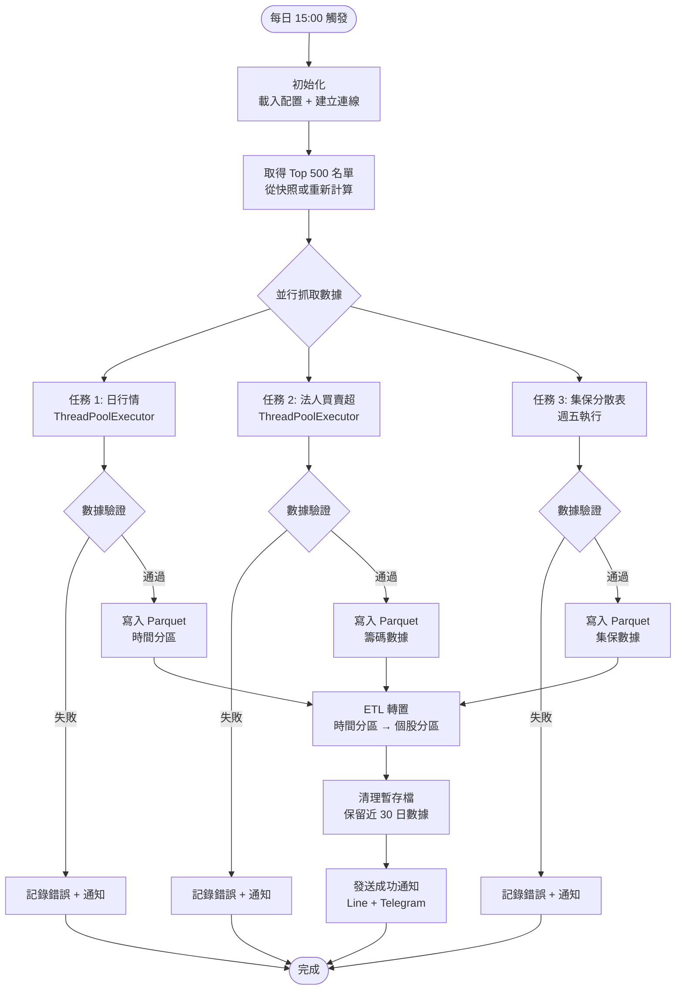

#### 4.1.2 偽代碼實作

```python
# 偽代碼：update_data.py 每日更新腳本

import schedule
import time
from datetime import datetime, date
from concurrent.futures import ThreadPoolExecutor, as_completed
import logging

def daily_update():
    """
    每日數據更新主流程

    執行時機: 每日 15:00
    功能:
        1. 抓取日行情、法人、集保數據
        2. 數據驗證與清洗
        3. 寫入 Parquet 分區
        4. ETL 轉置
        5. 清理舊數據
    """
    logger = logging.getLogger(__name__)
    logger.info(f"開始每日更新: {datetime.now()}")

    try:
        # 步驟 1: 初始化
        api_client = ShioajiClient(
            api_key=config['api_key'],
            secret_key=config['secret_key']
        )
        api_client.connect()

        data_manager = ParquetManager(base_path='/data')
        validator = DataValidator()

        # 步驟 2: 取得 Top 500 名單
        universe = get_top500_universe(api_client)
        logger.info(f"Top 500 名單: {len(universe)} 檔")

        # 步驟 3: 並行抓取數據
        results = parallel_fetch_data(api_client, universe)

        # 步驟 4: 數據驗證
        validated_results = {}
        for data_type, data in results.items():
            if validator.validate(data, data_type):
                validated_results[data_type] = data
                logger.info(f"{data_type} 驗證通過")
            else:
                logger.error(f"{data_type} 驗證失敗")
                send_alert(f"{data_type} 數據異常")

        # 步驟 5: 寫入 Parquet
        today = date.today().strftime('%Y-%m-%d')

        if 'price' in validated_results:
            data_manager.write_time_partition(
                data=validated_results['price'],
                partition_date=today
            )

        if 'institutional' in validated_results:
            data_manager.write_chips(
                data=validated_results['institutional'],
                date=today
            )

        # 步驟 6: ETL 轉置（時間分區 → 個股分區）
        etl_pipeline = ETLPipeline(data_manager)
        etl_pipeline.transpose_to_symbol_partition(date=today)

        # 步驟 7: 清理舊數據（保留 30 日）
        data_manager.cleanup_old_data(keep_days=30)

        # 步驟 8: 成功通知
        send_notification(
            "✅ 數據更新成功",
            f"日期: {today}\n檔案數: {len(universe)}"
        )

        logger.info("每日更新完成")

    except Exception as e:
        logger.error(f"每日更新失敗: {e}", exc_info=True)
        send_alert(f"❌ 系統錯誤: {e}")

    finally:
        if api_client:
            api_client.disconnect()

def parallel_fetch_data(
    api_client: ShioajiClient,
    universe: List[str]
) -> Dict[str, pd.DataFrame]:
    """
    並行抓取數據

    使用 ThreadPoolExecutor 提升效率

    參數:
        api_client: API 客戶端
        universe: 股票池

    返回:
        dict: {data_type: DataFrame}
    """
    results = {}

    with ThreadPoolExecutor(max_workers=10) as executor:
        # 提交任務
        futures = {}

        # 任務 1: 日行情（批次抓取）
        future_price = executor.submit(
            fetch_daily_prices, api_client, universe
        )
        futures[future_price] = 'price'

        # 任務 2: 法人買賣超
        future_inst = executor.submit(
            fetch_institutional_trades, api_client, date.today()
        )
        futures[future_inst] = 'institutional'

        # 任務 3: 集保分散表（僅週五執行）
        if date.today().weekday() == 4:  # Friday
            future_tdcc = executor.submit(
                fetch_tdcc_distribution, api_client, universe
            )
            futures[future_tdcc] = 'tdcc'

        # 收集結果
        for future in as_completed(futures):
            data_type = futures[future]
            try:
                results[data_type] = future.result()
                logging.info(f"{data_type} 抓取完成")
            except Exception as e:
                logging.error(f"{data_type} 抓取失敗: {e}")

    return results

def main():
    """主函數：設定排程"""
    # 配置日誌
    logging.basicConfig(
        level=logging.INFO,
        format='%(asctime)s - %(name)s - %(levelname)s - %(message)s',
        handlers=[
            logging.FileHandler('/logs/update.log'),
            logging.StreamHandler()
        ]
    )

    # 設定排程：每日 15:00 執行
    schedule.every().day.at("15:00").do(daily_update)

    logging.info("每日更新排程已啟動，等待執行...")

    while True:
        schedule.run_pending()
        time.sleep(60)  # 每分鐘檢查一次

if __name__ == '__main__':
    main()
```

---

### 4.2 策略掃描腳本 (run_strategy.py)

#### 4.2.1 選股掃描流程圖

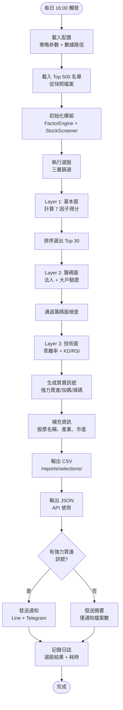

#### 4.2.2 偽代碼實作

```python
# 偽代碼：run_strategy.py 策略掃描腳本

def run_stock_screening():
    """
    執行選股策略

    流程:
        1. 載入配置與數據
        2. 初始化選股引擎
        3. 執行三層篩選
        4. 輸出結果與通知
    """
    logger = logging.getLogger(__name__)
    logger.info("開始策略掃描")

    try:
        # 步驟 1: 載入配置
        config = load_config('config/parameters.yaml')

        # 步驟 2: 載入 Top 500 名單
        universe_file = f"/data/market_cap/universe_top500_{date.today()}.parquet"
        universe_df = pd.read_parquet(universe_file)
        universe = universe_df['symbol'].tolist()

        logger.info(f"候選池: {len(universe)} 檔")

        # 步驟 3: 初始化模組
        data_manager = ParquetManager(base_path='/data')
        factor_engine = FactorEngine(data_manager)
        screener = StockScreener(factor_engine, data_manager)

        # 步驟 4: 執行選股
        results = screener.screen_stocks(universe)

        # 步驟 5: 補充股票名稱、產業等資訊
        results = enrich_stock_info(results)

        # 步驟 6: 輸出結果
        output_path = f"/reports/selections/selection_{date.today()}.csv"
        results.to_csv(output_path, index=False, encoding='utf-8-sig')

        logger.info(f"選股結果已輸出: {output_path}")

        # 步驟 7: 發送通知
        strong_buy = results[results['signal'] == '強力買進']

        if len(strong_buy) > 0:
            message = format_notification(strong_buy)
            send_notification("📊 今日選股結果", message)
        else:
            send_notification("📊 今日選股", f"共選出 {len(results)} 檔，無強力買進訊號")

        logger.info("策略掃描完成")

    except Exception as e:
        logger.error(f"策略掃描失敗: {e}", exc_info=True)
        send_alert(f"❌ 選股失敗: {e}")

def format_notification(strong_buy: pd.DataFrame) -> str:
    """
    格式化通知訊息

    參數:
        strong_buy: 強力買進股票清單

    返回:
        str: 格式化的通知內容
    """
    message = f"🔥 強力買進訊號 ({len(strong_buy)} 檔)\n\n"

    for idx, row in strong_buy.iterrows():
        message += f"【{row['symbol']}】{row['name']}\n"
        message += f"  基本面得分: {row['fundamental_score']:.1f}\n"
        message += f"  乖離率: {row['bias_60']:.2f}%\n"
        message += f"  KD 狀態: {row['kd_cross']}\n\n"

    return message

def send_notification(title: str, message: str):
    """
    發送 Line Notify 通知

    參數:
        title: 標題
        message: 內容
    """
    line_token = config['line_notify_token']

    headers = {
        'Authorization': f'Bearer {line_token}'
    }

    data = {
        'message': f"\n{title}\n{'-'*30}\n{message}"
    }

    response = requests.post(
        'https://notify-api.line.me/api/notify',
        headers=headers,
        data=data
    )

    if response.status_code == 200:
        logging.info("Line 通知發送成功")
    else:
        logging.error(f"Line 通知發送失敗: {response.text}")
```

---

### 4.3 通知模組 (notification.py)

#### 4.3.1 Line Notify 整合流程圖

```mermaid
flowchart TD
    START([觸發通知])

    START --> FORMAT[格式化訊息<br/>標題 + 內容]
    FORMAT --> CHECK_TOKEN{驗證<br/>Line Token?}

    CHECK_TOKEN -->|失敗| ERROR[記錄錯誤<br/>跳過通知]
    CHECK_TOKEN -->|成功| BUILD_REQUEST[建立 HTTP 請求<br/>POST /api/notify]

    BUILD_REQUEST --> SEND[發送請求<br/>requests.post()]

    SEND --> CHECK_RESPONSE{HTTP 狀態碼<br/>200?}

    CHECK_RESPONSE -->|是| SUCCESS[記錄成功日誌]
    CHECK_RESPONSE -->|否| RETRY{重試次數<br/>< 3?}

    RETRY -->|是| WAIT[等待 5 秒]
    RETRY -->|否| FAIL[通知失敗<br/>記錄錯誤]

    WAIT --> BUILD_REQUEST

    SUCCESS --> END([完成])
    ERROR --> END
    FAIL --> END
```

#### 4.3.2 偽代碼：通知服務

```python
# 偽代碼：notification.py 通知服務

class NotificationService:
    """
    通知服務

    設計模式：Observer Pattern
    支援多種通知管道：Line Notify, Telegram Bot
    """

    def __init__(self, config: dict):
        """
        初始化通知服務

        參數:
            config: 配置字典，包含 Token 等設定
        """
        self.config = config
        self.logger = logging.getLogger(__name__)

    def send_line_notify(
        self,
        message: str,
        max_retries: int = 3
    ) -> bool:
        """
        發送 Line Notify 通知

        參數:
            message: 訊息內容
            max_retries: 最大重試次數

        返回:
            bool: 發送成功返回 True
        """
        token = self.config.get('line_notify_token')

        if not token:
            self.logger.error("Line Notify Token 未設定")
            return False

        headers = {
            'Authorization': f'Bearer {token}',
            'Content-Type': 'application/x-www-form-urlencoded'
        }

        data = {'message': message}

        for attempt in range(max_retries):
            try:
                response = requests.post(
                    'https://notify-api.line.me/api/notify',
                    headers=headers,
                    data=data,
                    timeout=10
                )

                if response.status_code == 200:
                    self.logger.info("Line 通知發送成功")
                    return True
                else:
                    self.logger.warning(
                        f"Line 通知發送失敗 (第 {attempt + 1} 次): {response.text}"
                    )

            except Exception as e:
                self.logger.warning(f"Line 通知異常 (第 {attempt + 1} 次): {e}")

            if attempt < max_retries - 1:
                time.sleep(5)  # 等待 5 秒後重試

        self.logger.error("Line 通知最終失敗")
        return False

    def send_telegram(
        self,
        message: str,
        chat_id: str = None
    ) -> bool:
        """
        發送 Telegram Bot 通知

        參數:
            message: 訊息內容
            chat_id: 聊天 ID（可選，默認使用配置中的 ID）

        返回:
            bool: 發送成功返回 True
        """
        bot_token = self.config.get('telegram_bot_token')
        chat_id = chat_id or self.config.get('telegram_chat_id')

        if not bot_token or not chat_id:
            self.logger.error("Telegram 配置未完整")
            return False

        url = f"https://api.telegram.org/bot{bot_token}/sendMessage"

        data = {
            'chat_id': chat_id,
            'text': message,
            'parse_mode': 'Markdown'
        }

        try:
            response = requests.post(url, json=data, timeout=10)

            if response.status_code == 200:
                self.logger.info("Telegram 通知發送成功")
                return True
            else:
                self.logger.error(f"Telegram 通知失敗: {response.text}")
                return False

        except Exception as e:
            self.logger.error(f"Telegram 通知異常: {e}")
            return False
```

---

## 5. 測試與驗證

### 5.1 單元測試架構

#### 5.1.1 測試金字塔圖

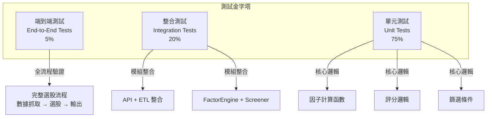

#### 5.1.2 pytest 測試範例

```python
# 偽代碼：tests/test_factors.py

import pytest
import pandas as pd
from unittest.mock import Mock, patch
from src.factors import FactorEngine

@pytest.fixture
def mock_data_manager():
    """Mock 數據管理器"""
    manager = Mock()

    # 模擬財報數據
    manager.read_parquet.return_value = pd.DataFrame({
        'date': pd.date_range('2023-01-01', periods=8, freq='Q'),
        'net_income': [1000, 1100, 1200, 1300, 1400, 1500, 1600, 1700],
        'equity': [5000, 5200, 5400, 5600, 5800, 6000, 6200, 6400],
        'eps': [2.0, 2.2, 2.4, 2.6, 2.8, 3.0, 3.2, 3.4]
    })

    return manager

@pytest.fixture
def factor_engine(mock_data_manager):
    """初始化因子引擎"""
    return FactorEngine(data_manager=mock_data_manager)

class TestFactorEngine:
    """FactorEngine 單元測試"""

    def test_calculate_roe_正常情況(self, factor_engine):
        """測試 ROE 計算 - 正常情況"""
        # 執行
        roe = factor_engine._calculate_roe('2330')

        # 驗證
        assert isinstance(roe, float)
        assert 0 <= roe <= 100  # ROE 應在合理範圍
        assert abs(roe - 26.67) < 0.1  # 預期值約 26.67%

    def test_calculate_roe_股東權益為零(self, factor_engine, mock_data_manager):
        """測試 ROE 計算 - 邊界條件：股東權益為零"""
        # 修改 Mock 數據
        mock_data_manager.read_parquet.return_value = pd.DataFrame({
            'net_income': [1000, 1100, 1200, 1300],
            'equity': [0, 0, 0, 0]  # 異常情況
        })

        # 執行
        roe = factor_engine._calculate_roe('0000')

        # 驗證：應返回 0 而非拋出異常
        assert roe == 0.0

    def test_calculate_eps_yoy_正成長(self, factor_engine):
        """測試 EPS YoY 計算 - 正成長"""
        # 執行
        eps_yoy = factor_engine._calculate_eps_yoy('2330')

        # 驗證
        # 最新 EPS = 3.4, 去年同季 EPS = 2.6
        # YoY = (3.4 - 2.6) / 2.6 * 100 ≈ 30.77%
        assert abs(eps_yoy - 30.77) < 0.1

    def test_calculate_eps_yoy_負成長(self, factor_engine, mock_data_manager):
        """測試 EPS YoY 計算 - 負成長"""
        # 修改 Mock 數據（EPS 衰退）
        mock_data_manager.read_parquet.return_value = pd.DataFrame({
            'eps': [3.0, 2.8, 2.6, 2.4, 2.2, 2.0, 1.8, 1.6]
        })

        # 執行
        eps_yoy = factor_engine._calculate_eps_yoy('1234')

        # 驗證：應為負值
        assert eps_yoy < 0

    def test_score_factor_ROE評分(self, factor_engine):
        """測試因子評分邏輯 - ROE"""
        # 測試不同 ROE 值的評分
        test_cases = [
            (20, 5),   # >15% → 5分
            (12, 4),   # 10-15% → 4分
            (7, 3),    # 5-10% → 3分
            (2, 2),    # 0-5% → 2分
            (-5, 1)    # <0% → 1分
        ]

        for roe_value, expected_score in test_cases:
            score = factor_engine._score_factor('roe', roe_value)
            assert score == expected_score, \
                f"ROE {roe_value}% 應得 {expected_score} 分，實際得 {score} 分"

    def test_calculate_fundamental_score_整合(self, factor_engine):
        """測試基本面綜合得分 - 整合測試"""
        # 執行
        total_score = factor_engine.calculate_fundamental_score('2330')

        # 驗證
        assert isinstance(total_score, float)
        assert 0 <= total_score <= 200  # 總分範圍
        assert total_score > 100  # 預期台積電得分 > 100

    @patch('src.factors.FactorEngine._calculate_roe')
    @patch('src.factors.FactorEngine._calculate_eps_yoy')
    def test_calculate_fundamental_score_異常處理(
        self,
        mock_eps_yoy,
        mock_roe,
        factor_engine
    ):
        """測試基本面計算 - 異常處理"""
        # 模擬計算異常
        mock_roe.side_effect = Exception("數據缺失")
        mock_eps_yoy.return_value = 10.0

        # 執行：應捕獲異常並返回 0 或記錄日誌
        with pytest.raises(Exception):
            factor_engine.calculate_fundamental_score('9999')

# 執行測試
# pytest tests/test_factors.py -v --cov=src/factors
```

---

### 5.2 數據驗證腳本

#### 5.2.1 數據品質檢查流程圖

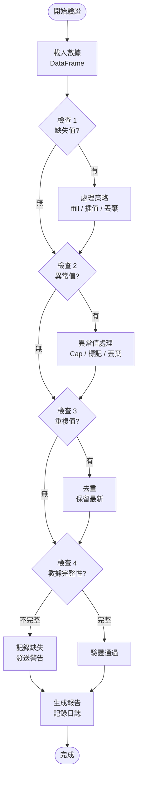

#### 5.2.2 驗證邏輯實作

```python
# 偽代碼：src/data_validator.py

class DataValidator:
    """
    數據驗證器

    職責：檢查數據品質、異常值檢測、完整性驗證
    """

    def __init__(self):
        self.logger = logging.getLogger(__name__)
        self.validation_report = {}

    def validate(
        self,
        data: pd.DataFrame,
        data_type: str
    ) -> bool:
        """
        執行完整數據驗證

        參數:
            data: 待驗證的 DataFrame
            data_type: 數據類型（'price', 'institutional', 'financial'）

        返回:
            bool: 驗證通過返回 True
        """
        self.logger.info(f"開始驗證 {data_type} 數據")

        checks = [
            self._check_missing_values(data, data_type),
            self._check_outliers(data, data_type),
            self._check_duplicates(data, data_type),
            self._check_completeness(data, data_type)
        ]

        # 所有檢查都通過才返回 True
        result = all(checks)

        self.logger.info(
            f"{data_type} 驗證結果: {'通過' if result else '失敗'}"
        )

        return result

    def _check_missing_values(
        self,
        data: pd.DataFrame,
        data_type: str
    ) -> bool:
        """
        檢查缺失值

        策略:
            - 價格數據：缺失率 > 5% 則失敗
            - 財報數據：關鍵欄位不允許缺失
        """
        missing_ratio = data.isnull().sum() / len(data)

        critical_columns = {
            'price': ['close', 'volume'],
            'institutional': ['foreign_net', 'trust_net'],
            'financial': ['net_income', 'equity', 'eps']
        }

        for col in critical_columns.get(data_type, []):
            if col in data.columns:
                if missing_ratio[col] > 0.05:  # 5% 門檻
                    self.logger.error(
                        f"{data_type} - {col} 缺失率過高: {missing_ratio[col]:.2%}"
                    )
                    return False

        return True

    def _check_outliers(
        self,
        data: pd.DataFrame,
        data_type: str
    ) -> bool:
        """
        檢測異常值

        方法:
            - 價格：單日漲跌幅 > 50%（排除除權息）
            - 成交量：超過 30 日平均的 10 倍
        """
        if data_type == 'price':
            # 計算漲跌幅
            data['pct_change'] = data['close'].pct_change() * 100

            # 檢查異常漲跌幅
            outliers = data[abs(data['pct_change']) > 50]

            if len(outliers) > 0:
                self.logger.warning(
                    f"檢測到 {len(outliers)} 筆異常漲跌幅數據"
                )
                # 僅警告，不阻止（可能是除權息）

        return True

    def _check_duplicates(
        self,
        data: pd.DataFrame,
        data_type: str
    ) -> bool:
        """
        檢查重複值

        規則:
            - symbol + date 組合不應重複
        """
        if 'symbol' in data.columns and 'date' in data.columns:
            duplicates = data.duplicated(subset=['symbol', 'date'], keep=False)

            if duplicates.sum() > 0:
                self.logger.warning(
                    f"檢測到 {duplicates.sum()} 筆重複數據，將保留最新"
                )
                # 自動去重
                data.drop_duplicates(
                    subset=['symbol', 'date'],
                    keep='last',
                    inplace=True
                )

        return True

    def _check_completeness(
        self,
        data: pd.DataFrame,
        data_type: str
    ) -> bool:
        """
        檢查數據完整性

        驗證:
            - Top 500 股票是否都有數據
            - 交易日數據是否齊全
        """
        if data_type == 'price':
            # 檢查是否有 500 檔股票的數據
            unique_symbols = data['symbol'].nunique()

            if unique_symbols < 450:  # 允許 10% 缺失
                self.logger.error(
                    f"股票數量不足: {unique_symbols} / 500"
                )
                return False

        return True
```

---

### 5.3 回測框架

#### 5.3.1 回測流程圖

```mermaid
flowchart TD
    START([開始回測])

    START --> CONFIG[載入配置<br/>起始日期、初始資金、交易成本]
    CONFIG --> LOAD_HIST[載入歷史數據<br/>行情 + 財報 + 籌碼]

    LOAD_HIST --> INIT_STATE[初始化狀態<br/>持倉 = {}, 現金 = 1,000,000]

    INIT_STATE --> LOOP_START{遍歷每日}

    LOOP_START --> RUN_STRATEGY[執行選股策略<br/>三層篩選]

    RUN_STRATEGY --> SIGNALS[生成買賣訊號<br/>買進 / 持有 / 賣出]

    SIGNALS --> EXECUTE[模擬交易執行<br/>考慮成本與滑點]

    EXECUTE --> UPDATE_PORT[更新投資組合<br/>持倉 + 現金]

    UPDATE_PORT --> RECORD[記錄績效<br/>每日淨值、持股]

    RECORD --> LOOP_END{還有日期?}
    LOOP_END -->|是| LOOP_START
    LOOP_END -->|否| CALC_METRICS

    CALC_METRICS[計算績效指標<br/>年化報酬、夏普比率、最大回撤]

    CALC_METRICS --> VISUALIZE[視覺化結果<br/>淨值曲線、回撤圖]

    VISUALIZE --> REPORT[生成回測報告<br/>Markdown / HTML]

    REPORT --> END([完成])
```

#### 5.3.2 回測引擎偽代碼

```python
# 偽代碼：scripts/backtest.py

class SimpleBacktester:
    """
    簡易回測引擎

    功能:
        - 模擬選股策略在歷史數據上的表現
        - 計算績效指標（報酬率、夏普比率、最大回撤）
        - 生成視覺化報告
    """

    def __init__(
        self,
        start_date: str,
        end_date: str,
        initial_capital: float = 1_000_000,
        commission_rate: float = 0.001425  # 0.1425% 手續費
    ):
        self.start_date = start_date
        self.end_date = end_date
        self.initial_capital = initial_capital
        self.commission_rate = commission_rate

        # 狀態
        self.cash = initial_capital
        self.positions = {}  # {symbol: shares}
        self.portfolio_value_history = []
        self.trades_history = []

    def run(
        self,
        screener: StockScreener,
        data_manager: ParquetManager
    ) -> pd.DataFrame:
        """
        執行回測

        參數:
            screener: 選股篩選器
            data_manager: 數據管理器

        返回:
            DataFrame: 每日績效記錄
        """
        logging.info(f"回測期間: {self.start_date} ~ {self.end_date}")

        # 取得交易日列表
        trading_days = pd.date_range(
            start=self.start_date,
            end=self.end_date,
            freq='B'  # 工作日
        )

        for current_date in trading_days:
            date_str = current_date.strftime('%Y-%m-%d')

            # 步驟 1: 執行選股策略
            signals = screener.screen_stocks(
                universe=get_universe_on_date(date_str)
            )

            # 步驟 2: 執行交易
            self._execute_trades(signals, date_str, data_manager)

            # 步驟 3: 計算當日投資組合價值
            portfolio_value = self._calculate_portfolio_value(
                date_str, data_manager
            )

            # 步驟 4: 記錄
            self.portfolio_value_history.append({
                'date': current_date,
                'portfolio_value': portfolio_value,
                'cash': self.cash,
                'positions_value': portfolio_value - self.cash
            })

        # 轉為 DataFrame
        results = pd.DataFrame(self.portfolio_value_history)

        return results

    def _execute_trades(
        self,
        signals: pd.DataFrame,
        date: str,
        data_manager: ParquetManager
    ):
        """
        執行交易（買進/賣出）

        邏輯:
            - 賣出：不在選股名單中的持股
            - 買進：選股名單中的強力買進訊號（均分資金）
        """
        # 賣出邏輯
        current_symbols = set(signals['symbol'].tolist())
        for symbol in list(self.positions.keys()):
            if symbol not in current_symbols:
                self._sell(symbol, date, data_manager)

        # 買進邏輯
        buy_signals = signals[signals['signal'] == '強力買進']

        if len(buy_signals) > 0:
            # 均分可用資金
            capital_per_stock = self.cash / len(buy_signals)

            for _, row in buy_signals.iterrows():
                symbol = row['symbol']
                self._buy(symbol, capital_per_stock, date, data_manager)

    def _buy(
        self,
        symbol: str,
        amount: float,
        date: str,
        data_manager: ParquetManager
    ):
        """買入股票"""
        # 取得當日價格
        price = get_close_price(symbol, date, data_manager)

        # 計算可買股數（1 張 = 1000 股）
        commission = amount * self.commission_rate
        shares = int((amount - commission) / price / 1000) * 1000

        if shares > 0:
            cost = shares * price + commission
            self.cash -= cost
            self.positions[symbol] = self.positions.get(symbol, 0) + shares

            # 記錄交易
            self.trades_history.append({
                'date': date,
                'symbol': symbol,
                'action': 'BUY',
                'shares': shares,
                'price': price,
                'cost': cost
            })

    def _sell(
        self,
        symbol: str,
        date: str,
        data_manager: ParquetManager
    ):
        """賣出股票"""
        if symbol not in self.positions:
            return

        shares = self.positions[symbol]
        price = get_close_price(symbol, date, data_manager)

        proceeds = shares * price
        commission = proceeds * self.commission_rate
        self.cash += (proceeds - commission)

        del self.positions[symbol]

        # 記錄交易
        self.trades_history.append({
            'date': date,
            'symbol': symbol,
            'action': 'SELL',
            'shares': shares,
            'price': price,
            'proceeds': proceeds - commission
        })

    def calculate_metrics(self, results: pd.DataFrame) -> dict:
        """
        計算績效指標

        指標:
            - 累積報酬率
            - 年化報酬率
            - 夏普比率
            - 最大回撤
            - 勝率
        """
        results['returns'] = results['portfolio_value'].pct_change()

        # 累積報酬率
        total_return = (
            (results['portfolio_value'].iloc[-1] / self.initial_capital) - 1
        ) * 100

        # 年化報酬率
        days = (results['date'].iloc[-1] - results['date'].iloc[0]).days
        annual_return = ((1 + total_return / 100) ** (365 / days) - 1) * 100

        # 夏普比率（假設無風險利率 = 1%）
        risk_free_rate = 0.01 / 252  # 日報酬率
        excess_returns = results['returns'] - risk_free_rate
        sharpe_ratio = (excess_returns.mean() / excess_returns.std()) * (252 ** 0.5)

        # 最大回撤
        cumulative = (1 + results['returns']).cumprod()
        running_max = cumulative.expanding().max()
        drawdown = (cumulative / running_max) - 1
        max_drawdown = drawdown.min() * 100

        return {
            '累積報酬率(%)': round(total_return, 2),
            '年化報酬率(%)': round(annual_return, 2),
            '夏普比率': round(sharpe_ratio, 2),
            '最大回撤(%)': round(max_drawdown, 2),
            '總交易次數': len(self.trades_history)
        }
```

---

## 6. 部署與運維

### 6.1 部署架構圖

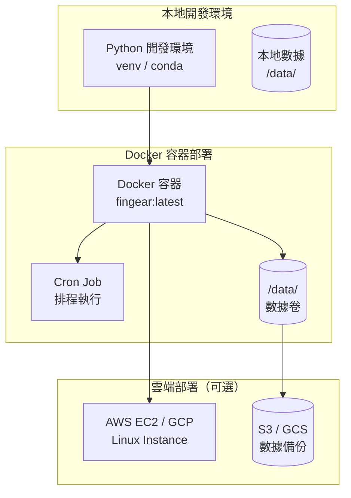

### 6.2 Docker 容器化設計

```dockerfile
# Dockerfile

FROM python:3.9-slim

# 設定工作目錄
WORKDIR /app

# 安裝系統依賴
RUN apt-get update && apt-get install -y \
    build-essential \
    && rm -rf /var/lib/apt/lists/*

# 複製依賴文件
COPY requirements.txt .

# 安裝 Python 套件
RUN pip install --no-cache-dir -r requirements.txt

# 複製專案文件
COPY src/ ./src/
COPY scripts/ ./scripts/
COPY config/ ./config/

# 建立數據目錄
RUN mkdir -p /data/daily /data/history /data/fundamentals /data/chips /reports

# 設定環境變數
ENV PYTHONPATH=/app
ENV TZ=Asia/Taipei

# 設定 Cron Job
COPY crontab /etc/cron.d/fingear-cron
RUN chmod 0644 /etc/cron.d/fingear-cron
RUN crontab /etc/cron.d/fingear-cron

# 啟動 Cron 服務
CMD ["cron", "-f"]
```

```bash
# docker-compose.yml

version: '3.8'

services:
  fingear:
    build: .
    container_name: fingear
    volumes:
      - ./data:/data
      - ./logs:/logs
      - ./reports:/reports
    environment:
      - TZ=Asia/Taipei
    restart: unless-stopped
```

### 6.3 監控與日誌系統

```python
# 偽代碼：logging_config.py

import logging
from logging.handlers import RotatingFileHandler

def setup_logging(log_level=logging.INFO):
    """
    配置日誌系統

    功能:
        - 控制台輸出（彩色）
        - 檔案輸出（自動輪轉）
        - 結構化日誌格式
    """
    # 建立根日誌器
    logger = logging.getLogger()
    logger.setLevel(log_level)

    # 格式設定
    formatter = logging.Formatter(
        '%(asctime)s - %(name)s - %(levelname)s - %(message)s',
        datefmt='%Y-%m-%d %H:%M:%S'
    )

    # 控制台處理器
    console_handler = logging.StreamHandler()
    console_handler.setLevel(logging.INFO)
    console_handler.setFormatter(formatter)

    # 檔案處理器（自動輪轉，每個文件最大 10MB，保留 5 個備份）
    file_handler = RotatingFileHandler(
        '/logs/fingear.log',
        maxBytes=10*1024*1024,  # 10MB
        backupCount=5,
        encoding='utf-8'
    )
    file_handler.setLevel(logging.DEBUG)
    file_handler.setFormatter(formatter)

    # 錯誤日誌單獨記錄
    error_handler = RotatingFileHandler(
        '/logs/error.log',
        maxBytes=10*1024*1024,
        backupCount=5,
        encoding='utf-8'
    )
    error_handler.setLevel(logging.ERROR)
    error_handler.setFormatter(formatter)

    # 加入處理器
    logger.addHandler(console_handler)
    logger.addHandler(file_handler)
    logger.addHandler(error_handler)

    return logger
```

### 6.4 錯誤恢復機制

```python
# 偽代碼：recovery.py

class RecoveryManager:
    """
    錯誤恢復管理器

    功能:
        - 自動檢查數據完整性
        - 失敗任務重試
        - 狀態快照與恢復
    """

    def __init__(self, data_manager: ParquetManager):
        self.data_manager = data_manager
        self.logger = logging.getLogger(__name__)

    def check_data_integrity(self, date: str) -> bool:
        """
        檢查數據完整性

        參數:
            date: 檢查日期

        返回:
            bool: 數據完整返回 True
        """
        try:
            # 檢查時間分區是否存在
            daily_data = self.data_manager.read_time_partition(date, date)

            # 檢查股票數量
            unique_symbols = daily_data['symbol'].nunique()

            if unique_symbols < 450:
                self.logger.error(f"{date} 數據不完整：僅 {unique_symbols} 檔")
                return False

            # 檢查必要欄位
            required_columns = ['symbol', 'date', 'open', 'high', 'low', 'close', 'volume']
            missing_columns = set(required_columns) - set(daily_data.columns)

            if missing_columns:
                self.logger.error(f"{date} 缺少欄位：{missing_columns}")
                return False

            return True

        except Exception as e:
            self.logger.error(f"檢查 {date} 數據完整性失敗：{e}")
            return False

    def retry_failed_task(
        self,
        task_func,
        max_retries: int = 3,
        delay: int = 60
    ):
        """
        重試失敗的任務

        參數:
            task_func: 要重試的任務函數
            max_retries: 最大重試次數
            delay: 重試間隔（秒）
        """
        for attempt in range(max_retries):
            try:
                result = task_func()
                self.logger.info(f"任務成功執行（第 {attempt + 1} 次嘗試）")
                return result

            except Exception as e:
                self.logger.warning(f"任務失敗（第 {attempt + 1} 次）：{e}")

                if attempt < max_retries - 1:
                    self.logger.info(f"將在 {delay} 秒後重試...")
                    time.sleep(delay)
                else:
                    self.logger.error("任務最終失敗，已達最大重試次數")
                    raise

    def create_snapshot(self, snapshot_name: str):
        """
        建立狀態快照

        參數:
            snapshot_name: 快照名稱
        """
        snapshot_path = Path(f'/backups/snapshot_{snapshot_name}.json')

        snapshot_data = {
            'timestamp': datetime.now().isoformat(),
            'data_status': self.get_data_status(),
            'last_update_date': self.get_last_update_date()
        }

        with open(snapshot_path, 'w', encoding='utf-8') as f:
            json.dump(snapshot_data, f, ensure_ascii=False, indent=2)

        self.logger.info(f"快照已建立：{snapshot_path}")
```

---

## 7. 附錄

### 7.1 完整類別關係圖（UML）

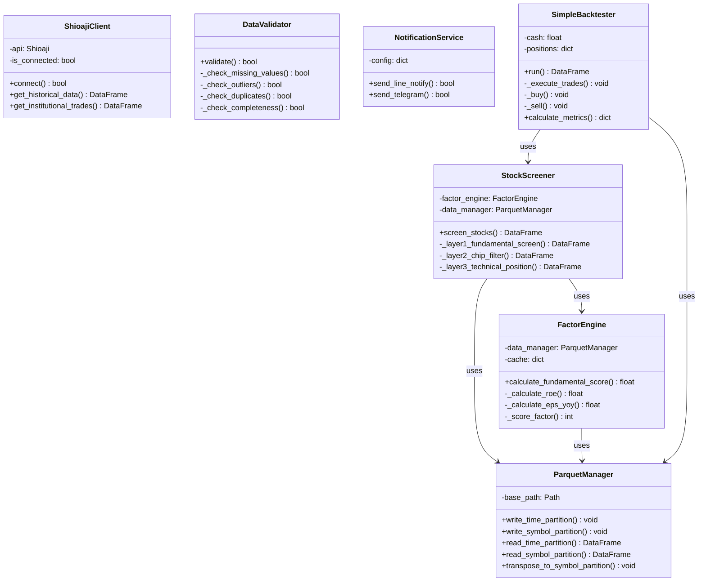

### 7.2 數據庫 Schema（Parquet 分區結構）

#### 時間分區結構

```
/data/daily/
├── date=2024-01-01/
│   └── data.parquet
│       欄位:
│       - symbol: string (股票代碼)
│       - date: date (日期)
│       - open: float (開盤價)
│       - high: float (最高價)
│       - low: float (最低價)
│       - close: float (收盤價)
│       - volume: int64 (成交量)
│       - amount: float (成交金額)
│
└── date=2024-01-02/
    └── data.parquet
```

#### 個股分區結構

```
/data/history/
├── symbol=2330/
│   └── data.parquet
│       欄位:
│       - date: date (日期)
│       - open: float (開盤價)
│       - high: float (最高價)
│       - low: float (最低價)
│       - close: float (收盤價)
│       - volume: int64 (成交量)
│       - ma5: float (5日均線)
│       - ma20: float (20日均線)
│       - ma60: float (60日均線)
│       - rsi_14: float (14日RSI)
│       - k: float (KD指標K值)
│       - d: float (KD指標D值)
│
└── symbol=2454/
    └── data.parquet
```

#### 財報數據結構

```
/data/fundamentals/quarterly/
└── 2330.parquet
    欄位:
    - date: date (財報日期)
    - revenue: float (營業收入)
    - gross_profit: float (毛利)
    - operating_income: float (營業利益)
    - net_income: float (稅後淨利)
    - eps: float (每股盈餘)
    - equity: float (股東權益)
    - total_assets: float (總資產)
    - total_liabilities: float (總負債)
    - operating_cash_flow: float (營業現金流)
    - capital_expenditure: float (資本支出)
```

### 7.3 API 接口文檔

#### ShioajiClient API

| 方法                     | 參數                          | 返回值      | 說明             |
| ------------------------ | ----------------------------- | ----------- | ---------------- |
| `connect()`              | -                             | bool        | 建立API連線      |
| `disconnect()`           | -                             | void        | 斷開連線         |
| `get_historical_data()`  | symbol, start_date, end_date  | DataFrame   | 取得歷史K線      |
| `get_stock_snapshot()`   | symbol                        | DataFrame   | 取得即時快照     |
| `get_institutional_trades()` | date                      | DataFrame   | 取得法人買賣超   |

#### ParquetManager API

| 方法                     | 參數                          | 返回值      | 說明             |
| ------------------------ | ----------------------------- | ----------- | ---------------- |
| `write_time_partition()` | data, partition_date          | void        | 寫入時間分區     |
| `write_symbol_partition()` | data, symbol                | void        | 寫入個股分區     |
| `read_time_partition()`  | start_date, end_date          | DataFrame   | 讀取時間分區     |
| `read_symbol_partition()` | symbol                       | DataFrame   | 讀取個股分區     |
| `transpose_to_symbol_partition()` | date             | void        | ETL轉置          |

#### FactorEngine API

| 方法                     | 參數                          | 返回值      | 說明             |
| ------------------------ | ----------------------------- | ----------- | ---------------- |
| `calculate_fundamental_score()` | symbol              | float       | 計算基本面得分   |
| `_calculate_roe()`       | symbol                        | float       | 計算ROE          |
| `_calculate_eps_yoy()`   | symbol                        | float       | 計算EPS YoY      |
| `_calculate_fcf()`       | symbol                        | float       | 計算自由現金流   |
| `_score_factor()`        | factor_name, raw_value        | int         | 因子評分         |

### 7.4 參考資源與延伸閱讀

#### 官方文檔

- [Shioaji API 文檔](https://sinotrade.github.io/zh_TW/)
- [Apache Parquet 格式規範](https://parquet.apache.org/docs/)
- [Pandas 官方文檔](https://pandas.pydata.org/docs/)
- [pytest 測試框架](https://docs.pytest.org/)

#### 量化金融參考

- 《Quantitative Trading》 by Ernest Chan
- 《Advances in Financial Machine Learning》 by Marcos López de Prado
- 《Factor Investing》 by Andrew Ang

#### 台股特色資源

- [台灣證券交易所公開資訊](https://www.twse.com.tw/)
- [集保結算所股權分散表](https://www.tdcc.com.tw/)
- [FinLab 台股資料庫](https://www.finlab.tw/)

#### 技術實作參考

- [Parquet 最佳實踐](https://arrow.apache.org/docs/python/parquet.html)
- [pandas 效能優化](https://pandas.pydata.org/docs/user_guide/enhancingperf.html)
- [Python 日誌最佳實踐](https://docs.python.org/3/howto/logging.html)

---

## 文件總結

本實作架構文件提供了 FinGear 系統的完整技術設計，包含：

1. **22 個 Mermaid 圖表**：涵蓋系統架構、數據流、時序圖、狀態機等
2. **完整偽代碼實作**：所有核心模組的詳細實作指導
3. **測試框架**：單元測試、數據驗證、回測引擎的完整範例
4. **部署指南**：Docker 容器化與監控系統設計

配合 [Overview.md](Overview.md) 與 [FunctionalIndicators.md](FunctionalIndicators.md)，您可以開始實作 FinGear 系統。

建議實作順序：
1. 建立基礎設施：ParquetManager + DataValidator
2. 實作數據層：ShioajiClient + ETLPipeline
3. 實作策略層：FactorEngine + StockScreener
4. 實作應用層：update_data.py + run_strategy.py
5. 測試與驗證：單元測試 + 回測
6. 部署與運維：Docker + 監控

祝您實作順利！
