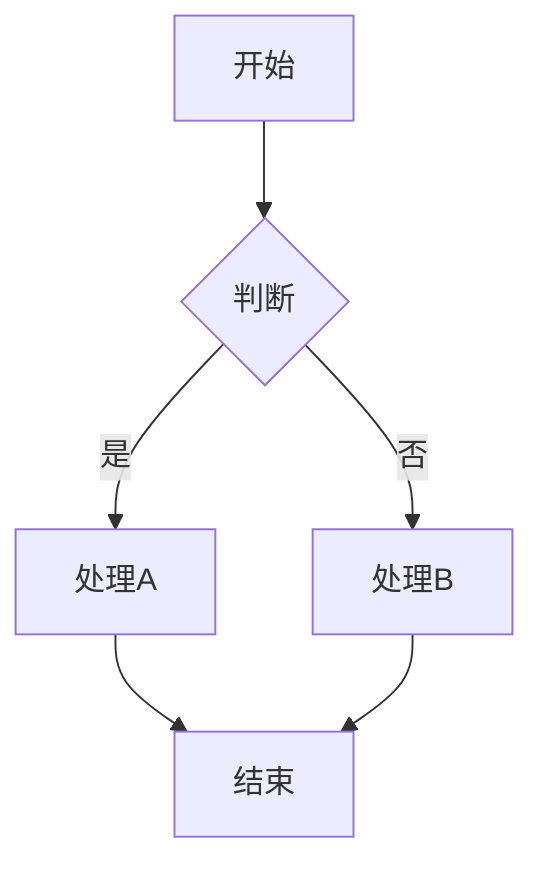
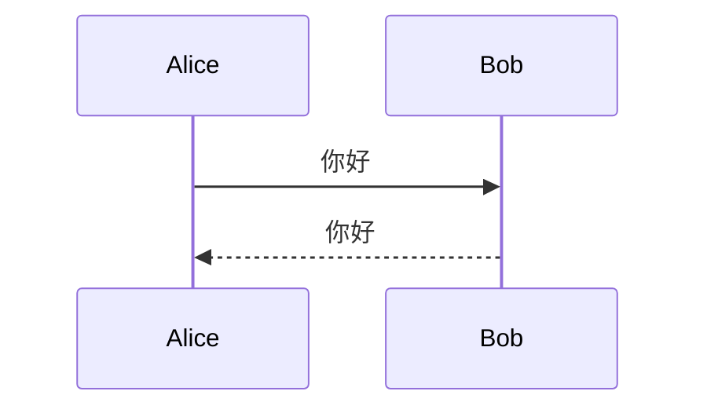
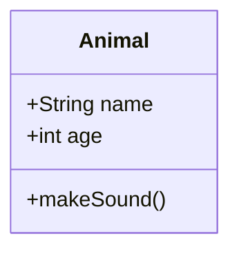

# Markdown Preview Enhanced 深色主题完整配置指南

> **目标**：让 Markdown 预览和 Mermaid 图表都显示为**黑底白字**的深色风格  
> **适用插件**：Markdown Preview Enhanced (作者: Yiyi Wang)  
> **更新日期**：2026-01-02

---

## 📋 目录

1. [快速开始](#快速开始)
2. [Markdown 整体样式配置](#markdown-整体样式配置)
3. [Mermaid 深色主题配置](#mermaid-深色主题配置)
4. [自动化配置脚本](#自动化配置脚本)
5. [故障排查](#故障排查)
6. [配置文件说明](#配置文件说明)
7. [预期效果](#预期效果)

---

## 快速开始

### ✅ 已完成的配置

以下配置文件已自动部署到您的系统：

| 文件 | 位置 | 状态 |
|------|------|------|
| `config.js` | `C:\Users\ron.chang\.crossnote\` | ✅ 已复制 |
| `style.less` | `C:\Users\ron.chang\.crossnote\` | ✅ 已复制 |

### 🎯 应用配置（3 步完成）

1. **重新加载 VS Code**
   - 按 `Ctrl + Shift + P`
   - 输入：`Developer: Reload Window`
   - 回车

2. **打开 Markdown 预览**
   - 打开任意 `.md` 文件
   - 按 `Ctrl + K V`

3. **验证效果**
   - 背景应该是**深黑色**
   - 文字应该是**浅色**
   - Mermaid 图表也应该是**深色主题**

---

## Markdown 整体样式配置

### 配置方法

Markdown Preview Enhanced 使用 `style.less` 文件来自定义预览样式。

### 样式特点

我们的配置包含：

#### 🎨 配色方案

| 元素 | 颜色值 | 说明 |
|------|--------|------|
| 背景 | `#1e1e1e` | 深黑色，与 VS Code 主题一致 |
| 正文 | `#d4d4d4` | 浅灰白色，清晰易读 |
| 标题 | `#ffffff` | 纯白色，高对比度 |
| 链接 | `#4ec9b0` | 青绿色，符合 VS Code 风格 |
| 链接悬停 | `#6fdcc8` | 浅青绿色 |
| 代码行内 | `#ce9178` | 橙色 |
| 代码块背景 | `#2d2d2d` | 深灰色 |
| 代码块文字 | `#d4d4d4` | 浅灰白色 |
| 引用块背景 | `#2d2d2d` | 深灰色 |
| 引用块边框 | `#4ec9b0` | 青绿色 |
| 表格背景（奇数行） | `#252525` | 深灰色 |
| 表格背景（偶数行） | `#2d2d2d` | 略浅的灰色 |
| 表格边框 | `#404040` | 中灰色 |
| 水平线 | `#404040` | 中灰色 |
| 强调文本 | `#ffffff` | 纯白色 |
| 斜体 | `#ce9178` | 橙色 |

#### 📐 涵盖的元素

- ✅ 标题 (h1-h6)
- ✅ 段落文字
- ✅ 链接（普通状态 + 悬停状态）
- ✅ 代码块（行内 + 块级）
- ✅ 引用块
- ✅ 表格（表头 + 表体 + 斑马纹）
- ✅ 列表（有序 + 无序）
- ✅ 任务列表
- ✅ 水平线
- ✅ 图片
- ✅ 强调文本（粗体 + 斜体）

### 访问配置文件

按 `Ctrl + Shift + P`，输入：
```
Markdown Preview Enhanced: Customize CSS
```

这会打开 `style.less` 文件，您可以根据需要调整颜色。

---

## Mermaid 深色主题配置

### 问题说明

Mermaid 图表默认使用浅色主题，即使配置了深色的 Markdown 预览主题，Mermaid 图表也可能保持白色背景。

### 解决方案（双重保险）

我们采用**两层配置**确保 Mermaid 使用深色主题：

#### 第一层：config.js 配置

**位置**：`C:\Users\ron.chang\.crossnote\config.js`

**关键配置**：

```javascript
mermaidConfig: {
  theme: 'dark',
  themeVariables: {
    // 主要颜色
    primaryColor: '#1e3a5f',
    primaryTextColor: '#e0e0e0',
    primaryBorderColor: '#4ec9b0',
    
    // 线条和背景
    lineColor: '#4ec9b0',
    mainBkg: '#1e1e1e',
    secondBkg: '#2d2d2d',
    textColor: '#e0e0e0',
    
    // 边框
    border1: '#404040',
    border2: '#4ec9b0',
    
    // 连接线和箭头
    arrowheadColor: '#4ec9b0',
    defaultLinkColor: '#4ec9b0',
    
    // Cluster（子图）
    clusterBkg: '#252525',
    clusterBorder: '#404040',
    
    // Sequence Diagram
    actorBorder: '#4ec9b0',
    actorBkg: '#2d2d2d',
    actorTextColor: '#e0e0e0',
    actorLineColor: '#4ec9b0',
    signalColor: '#e0e0e0',
    signalTextColor: '#e0e0e0',
    
    // 标签
    labelBoxBkgColor: '#2d2d2d',
    labelBoxBorderColor: '#4ec9b0',
    labelTextColor: '#e0e0e0',
    
    // 注释
    noteBorderColor: '#4ec9b0',
    noteBkgColor: '#2d2d2d',
    noteTextColor: '#e0e0e0',
    
    // 其他
    titleColor: '#ffffff',
    edgeLabelBackground: '#1e1e1e',
    fontFamily: '"Segoe UI", Tahoma, Geneva, Verdana, sans-serif',
    fontSize: '16px'
  }
}
```

#### 第二层：style.less CSS 强制覆盖

**位置**：`C:\Users\ron.chang\.crossnote\style.less`

**关键样式**：

```less
/* Mermaid 图表 - 深色主题强制覆盖 */
.mermaid {
  background-color: #1e1e1e !important;
  
  svg {
    background-color: #1e1e1e !important;
    
    /* 所有文字 */
    text {
      fill: #e0e0e0 !important;
    }
    
    /* 节点 */
    .node rect, .node circle, .node ellipse, .node polygon {
      fill: #2d2d2d !important;
      stroke: #4ec9b0 !important;
      stroke-width: 2px !important;
    }
    
    /* 连接线 */
    .edgePath path, .flowchart-link {
      stroke: #4ec9b0 !important;
      stroke-width: 2px !important;
    }
    
    /* 箭头 */
    .arrowheadPath, marker path {
      fill: #4ec9b0 !important;
      stroke: #4ec9b0 !important;
    }
    
    /* 更多样式... */
  }
}
```

### 支持的图表类型

配置覆盖所有 Mermaid 图表类型：

- ✅ **Flowchart** - 流程图
- ✅ **Sequence Diagram** - 时序图
- ✅ **Class Diagram** - 类图
- ✅ **State Diagram** - 状态图
- ✅ **Gantt Chart** - 甘特图
- ✅ **Pie Chart** - 饼图
- ✅ **Git Graph** - Git 流程图
- ✅ **ER Diagram** - 实体关系图

---

## 自动化配置脚本

### PowerShell 脚本（一键部署）

如果需要重新部署或在其他机器上配置，可以运行：

```powershell
# 复制配置文件
Copy-Item "c:\Py_workspace\FinGear\.mpe_config.js" "$env:USERPROFILE\.crossnote\config.js" -Force

# 复制样式文件
Copy-Item "c:\Py_workspace\FinGear\.mpe_style.less" "$env:USERPROFILE\.crossnote\style.less" -Force

# 验证
Write-Host "配置文件已复制完成！" -ForegroundColor Green
Write-Host "请重新加载 VS Code 窗口以应用更改。" -ForegroundColor Yellow
```

### 验证脚本

```powershell
# 检查 config.js
if (Test-Path "$env:USERPROFILE\.crossnote\config.js") {
    Write-Host "✅ config.js 存在" -ForegroundColor Green
    Get-Content "$env:USERPROFILE\.crossnote\config.js" | Select-Object -First 5
} else {
    Write-Host "❌ config.js 不存在" -ForegroundColor Red
}

# 检查 style.less
if (Test-Path "$env:USERPROFILE\.crossnote\style.less") {
    Write-Host "✅ style.less 存在" -ForegroundColor Green
    Get-Content "$env:USERPROFILE\.crossnote\style.less" | Select-String ".mermaid" | Select-Object -First 1
} else {
    Write-Host "❌ style.less 不存在" -ForegroundColor Red
}
```

---

## 故障排查

### 问题 1: 配置后仍然显示浅色主题

#### 解决步骤：

1. **完全重启 VS Code**
   - 不要只是重新加载窗口
   - 关闭所有 VS Code 窗口
   - 等待 5-10 秒
   - 重新打开

2. **清除缓存**
   ```powershell
   # 关闭 VS Code 后运行
   Remove-Item "$env:APPDATA\Code\Cache\*" -Recurse -Force -ErrorAction SilentlyContinue
   Remove-Item "$env:APPDATA\Code\CachedData\*" -Recurse -Force -ErrorAction SilentlyContinue
   ```

3. **检查配置文件**
   ```powershell
   # 检查 mermaidConfig
   Get-Content "$env:USERPROFILE\.crossnote\config.js" | Select-String "theme"
   
   # 应该看到：theme: 'dark',
   ```

4. **手动编辑检查**
   - 用 VS Code 打开 `C:\Users\ron.chang\.crossnote\config.js`
   - 搜索 `mermaidConfig`
   - 确认 `theme: 'dark'` 存在

### 问题 2: 部分元素仍是浅色

#### 可能原因：

- CSS 优先级不够高
- 某些 Mermaid 元素未被覆盖

#### 解决方法：

在 `style.less` 中添加更多 `!important` 标记：

```less
.mermaid svg * {
  background-color: transparent !important;
}

.mermaid svg text {
  fill: #e0e0e0 !important;
  color: #e0e0e0 !important;
}
```

### 问题 3: 配置文件位置不正确

#### 查找实际配置目录：

1. 按 `Ctrl + Shift + P`
2. 输入：`Markdown Preview Enhanced: Customize CSS`
3. 查看打开的文件路径
4. 将配置应用到该路径

#### 常见位置：

- `C:\Users\{用户名}\.crossnote\`
- `C:\Users\{用户名}\.mume\`
- `%APPDATA%\Code\User\.crossnote\`

### 问题 4: VS Code 设置冲突

#### 检查 settings.json：

按 `Ctrl + ,` 打开设置，搜索：`markdown-preview-enhanced`

确保没有冲突的设置，如：

```json
{
  "markdown-preview-enhanced.mermaidTheme": "dark",
  "markdown-preview-enhanced.previewTheme": "github-dark.css",
  "markdown-preview-enhanced.codeBlockTheme": "monokai.css"
}
```

### 问题 5: 插件版本问题

#### 更新插件：

1. 按 `Ctrl + Shift + X`
2. 搜索：`Markdown Preview Enhanced`
3. 如果有更新，点击"更新"
4. 重启 VS Code

#### 重新安装：

1. 卸载 Markdown Preview Enhanced
2. 重启 VS Code
3. 重新安装插件
4. 重新应用配置

---

## 配置文件说明

### config.js 结构

```javascript
({
  // KaTeX 数学公式配置
  katexConfig: { ... },
  
  // MathJax 配置
  mathjaxConfig: { ... },
  
  // ⭐ Mermaid 配置（重点）
  mermaidConfig: {
    theme: 'dark',
    themeVariables: { ... }
  },
  
  // 解析器配置
  parserConfig: { ... },
  
  // 其他全局配置
  mermaidTheme: 'dark',
  codeBlockTheme: 'monokai.css',
  previewTheme: 'github-dark.css',
  revealjsTheme: 'black.css',
  
  // 功能开关
  scrollSync: true,
  liveUpdate: true,
  openPreviewToTheSide: true,
  printBackground: true,
  
  // 更多配置...
})
```

### style.less 结构

```less
.markdown-preview.markdown-preview {
  // 1. 基础样式
  background-color: #1e1e1e;
  color: #d4d4d4;
  
  // 2. 标题样式
  h1, h2, h3, h4, h5, h6 { ... }
  
  // 3. 链接样式
  a { ... }
  
  // 4. 代码样式
  code { ... }
  pre { ... }
  
  // 5. 引用块
  blockquote { ... }
  
  // 6. 表格
  table { ... }
  
  // 7. ⭐ Mermaid（重点）
  .mermaid {
    svg {
      // 所有 SVG 元素的样式覆盖
    }
  }
}
```

---

## 预期效果

### Markdown 预览效果

#### 整体外观
- 🖤 **背景**：深黑色 `#1e1e1e`
- 🤍 **文字**：浅灰白色 `#d4d4d4`
- ✨ **标题**：纯白色 `#ffffff`
- 🔗 **链接**：青绿色 `#4ec9b0`

#### 代码块
- 📦 **背景**：深灰色 `#2d2d2d`
- 📝 **代码**：浅灰白色 `#d4d4d4`
- 🎨 **语法高亮**：Monokai 主题

#### 表格
- 🦓 **斑马纹**：两种深灰色交替
- 📏 **边框**：中灰色 `#404040`
- 📋 **表头**：深灰背景 + 白色文字

### Mermaid 图表效果

#### Flowchart（流程图）


**预期效果**：
- 🖤 背景：`#1e1e1e`
- 📦 节点：`#2d2d2d` 背景 + `#4ec9b0` 边框
- ✏️ 文字：`#e0e0e0`
- 🔗 连接线：`#4ec9b0`
- ➡️ 箭头：`#4ec9b0`

#### Sequence Diagram（时序图）


**预期效果**：
- 👤 Actor：`#2d2d2d` 背景 + `#4ec9b0` 边框
- 💬 消息线：`#4ec9b0`
- 📝 文字：`#e0e0e0`

#### Class Diagram（类图）


**预期效果**：
- 📦 类框：`#2d2d2d` 背景 + `#4ec9b0` 边框
- 📏 分隔线：`#4ec9b0`
- ✏️ 文字：`#e0e0e0`

---

## 高级配置

### 自定义颜色

如果您想修改配色方案，编辑 `config.js` 中的 `themeVariables`：

```javascript
themeVariables: {
  // 主要颜色（节点背景）
  primaryColor: '#你的颜色',
  
  // 文字颜色
  primaryTextColor: '#你的颜色',
  
  // 边框和线条颜色
  primaryBorderColor: '#你的颜色',
  lineColor: '#你的颜色',
  
  // 背景颜色
  mainBkg: '#你的颜色',
  secondBkg: '#你的颜色',
}
```

### 使用其他 Mermaid 主题

Mermaid 支持以下主题：

| 主题 | 说明 | 适用场景 |
|------|------|----------|
| `dark` | 深色主题 | ⭐ 推荐 - 黑底白字 |
| `default` | 默认浅色 | 白底黑字 |
| `forest` | 森林绿 | 绿色调 |
| `neutral` | 中性灰 | 灰色调 |
| `base` | 基础主题 | 简约风格 |

在 `config.js` 中修改：
```javascript
mermaidConfig: {
  theme: 'forest',  // 改为其他主题
}
```

---

## 文档追踪清单

### 已创建的文件

| 文件 | 位置 | 用途 |
|------|------|------|
| `.mpe_config.js` | `c:\Py_workspace\FinGear\` | Mermaid 配置源文件 |
| `.mpe_style.less` | `c:\Py_workspace\FinGear\` | CSS 样式源文件 |
| `config.js` | `C:\Users\ron.chang\.crossnote\` | ✅ 已部署 |
| `style.less` | `C:\Users\ron.chang\.crossnote\` | ✅ 已部署 |

### 配置状态检查清单

- [x] config.js 已复制到 `.crossnote` 目录
- [x] style.less 已复制到 `.crossnote` 目录
- [x] 配置文件包含 `mermaidConfig.theme: 'dark'`
- [x] style.less 包含 `.mermaid` 样式覆盖
- [ ] VS Code 已重新加载
- [ ] Markdown 预览显示深色背景
- [ ] Mermaid 图表显示深色主题

---

## 快速参考

### 常用命令

| 操作 | 快捷键 / 命令 |
|------|---------------|
| 打开侧边预览 | `Ctrl + K V` |
| 打开新标签预览 | `Ctrl + Shift + V` |
| 自定义 CSS | `Ctrl + Shift + P` → `Customize CSS` |
| 重新加载窗口 | `Ctrl + Shift + P` → `Reload Window` |
| 打开设置 | `Ctrl + ,` |
| 打开设置 JSON | `Ctrl + Shift + P` → `Open Settings (JSON)` |

### 配置文件路径

```
配置目录：C:\Users\ron.chang\.crossnote\
├── config.js      # Mermaid 和全局配置
├── style.less     # 自定义 CSS 样式
├── head.html      # 自定义 HTML 头部（可选）
└── parser.js      # 自定义解析器（可选）
```

---

## 总结

通过本指南的配置，您的 Markdown Preview Enhanced 将拥有：

✅ **完整的深色主题**
- Markdown 内容深色背景
- Mermaid 图表深色主题
- 统一的配色方案

✅ **双重保障机制**
- config.js 主题配置
- style.less CSS 强制覆盖

✅ **自动化部署**
- 配置文件已复制到位
- 一键重新加载即可生效

如有任何问题，请参考[故障排查](#故障排查)章节。

---

**最后更新**：2026-01-02  
**作者**：Antigravity AI Assistant  
**适用版本**：Markdown Preview Enhanced (Latest)
