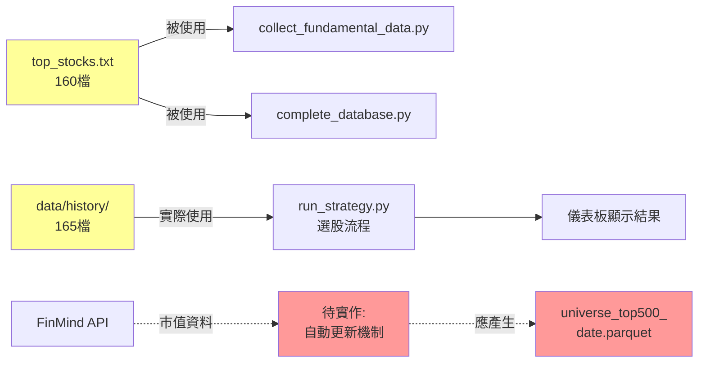
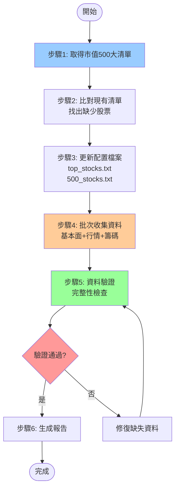

# 市值 500 大股票資料補全實作計畫

**文檔版本**: 1.0
**建立時間**: 2026-01-04
**負責模組**: 資料收集與股票池管理

---

## 一、需求背景

### 1.1 問題陳述

**現況問題**：
- 系統設計目標為「市值 Top 500」（見 `docs/Overview.md`、`README.md`）
- 實際清單僅包含 **160 檔股票**（`config/top_stocks.txt`）
- 選股池來源為 `data/history/` 目錄（165 檔），與設計文檔不符

**發現異常**：
- 股票 2207（和泰車）出現在選股結果中，但不在 `top_stocks.txt`
- 有 5 檔股票存在於 `data/history/` 但未列入 `top_stocks.txt`：
  ```
  2207, 2481, 2609, 2615, 6116
  ```

### 1.2 目標

1. **補全股票清單**：將 `top_stocks.txt` 從 160 檔擴充至 **市值 500 大**
2. **統一資料來源**：確保 `top_stocks.txt` 與 `docs/500_stocks.txt` 一致
3. **建立自動化機制**：實作每日市值排名更新（參考 `docs/Overview.md` 第 2.2 節）
4. **補全歷史資料**：為新增股票收集完整的基本面、行情、籌碼資料

---

## 二、現況分析

### 2.1 資料清單對照

| 清單來源 | 檔案數 | 用途 | 備註 |
|---------|-------|------|-----|
| `config/top_stocks.txt` | 160 | 基本面資料收集範圍 | ⚠️ 與設計不符 |
| `docs/500_stocks.txt` | 160 | 股票名稱對照表 | 與 config 相同 |
| `data/history/symbol=*/` | 165 | **實際選股池** | 包含 5 檔額外股票 |
| **預期目標** | **500** | 市值 Top 500 | 需補充 335-340 檔 |

### 2.2 資料流程分析



**關鍵發現**：
- ✅ `run_strategy.py` 的選股池 **不依賴** `top_stocks.txt`
- ⚠️ `top_stocks.txt` 僅影響基本面資料收集範圍
- ❌ 系統缺少市值排名更新機制（`docs/Overview.md` 設計中有，但未實作）

### 2.3 缺口分析

**需補充的股票數量**：
- 目標 500 檔 - 現有 160 檔 = **約 340 檔**

**需補充的資料類型**：
1. **基本面資料**（`data/fundamentals/`）：季報、月營收（過去 18 個月）
2. **歷史行情**（`data/history/`）：OHLCV + 技術指標（過去 30 天或更長）
3. **籌碼資料**（`data/chips/`）：法人買賣、集保資料（過去 30 天）

**預估資料量**：
- 每檔股票約 10-15 MB（含完整歷史）
- 340 檔 × 15 MB ≈ **5.1 GB**

---

## 三、實作方案

### 3.1 整體架構



### 3.2 詳細實作步驟

#### **步驟 1：取得市值 500 大清單**

**方法 A：使用 FinMind API（推薦）**

```python
from FinMind.data import DataLoader
import pandas as pd
from datetime import datetime, timedelta

def get_top_500_by_market_cap(date: str = None) -> pd.DataFrame:
    """
    取得指定日期的市值 Top 500 股票

    Args:
        date: 日期字串 'YYYY-MM-DD'，預設為最近交易日

    Returns:
        DataFrame with columns: stock_id, stock_name, market_value, rank
    """
    dl = DataLoader()

    # 設定日期範圍（取最近 5 個交易日）
    if date is None:
        end_date = datetime.now()
        start_date = end_date - timedelta(days=7)
    else:
        end_date = datetime.strptime(date, '%Y-%m-%d')
        start_date = end_date - timedelta(days=7)

    # 1. 取得所有上市櫃股票清單
    stock_info = dl.taiwan_stock_info()
    tse_otc_stocks = stock_info[
        stock_info['type'].isin(['twse', 'tpex'])
    ]['stock_id'].tolist()

    print(f"總股票數: {len(tse_otc_stocks)}")

    # 2. 批次取得市值資料（避免 API rate limit）
    market_values = []
    batch_size = 50  # 每批 50 檔

    for i in range(0, len(tse_otc_stocks), batch_size):
        batch = tse_otc_stocks[i:i+batch_size]
        try:
            df = dl.taiwan_stock_market_value(
                stock_id_list=batch,
                start_date=start_date.strftime('%Y-%m-%d'),
                end_date=end_date.strftime('%Y-%m-%d')
            )
            market_values.append(df)
            print(f"進度: {i+len(batch)}/{len(tse_otc_stocks)}")
            time.sleep(0.5)  # Rate limiting
        except Exception as e:
            print(f"批次 {i} 失敗: {e}")
            continue

    # 3. 合併並取最新日期的市值
    all_data = pd.concat(market_values, ignore_index=True)
    latest_date = all_data['date'].max()
    latest_data = all_data[all_data['date'] == latest_date].copy()

    # 4. 排序並取前 500
    latest_data = latest_data.sort_values('market_value', ascending=False)
    latest_data['rank'] = range(1, len(latest_data) + 1)
    top_500 = latest_data.head(500)

    # 5. 加入股票名稱
    top_500 = top_500.merge(
        stock_info[['stock_id', 'stock_name']],
        on='stock_id',
        how='left'
    )

    return top_500[['stock_id', 'stock_name', 'market_value', 'rank']]
```

**方法 B：從證交所官網爬取（備用）**

```python
import requests
from io import StringIO

def get_top_500_from_twse() -> pd.DataFrame:
    """
    從證交所抓取上市公司市值資料
    （需另外處理上櫃股票）
    """
    url = "https://www.twse.com.tw/zh/page/trading/exchange/MI_INDEX.html"
    # 實作略（需處理 JS 渲染與分頁）
    pass
```

**輸出格式**：

```csv
stock_id,stock_name,market_value,rank
2330,台積電,15234567890000,1
2317,鴻海,1234567890000,2
2454,聯發科,987654321000,3
...
```

#### **步驟 2：比對現有清單**

```python
def compare_stock_lists(new_top_500: pd.DataFrame) -> dict:
    """
    比對新舊清單，找出差異

    Returns:
        {
            'to_add': List[str],      # 需新增的股票
            'to_remove': List[str],   # 需移除的股票（跌出500）
            'unchanged': List[str]    # 保持不變的股票
        }
    """
    # 讀取現有清單
    current_stocks = []
    with open('config/top_stocks.txt', 'r', encoding='utf-8') as f:
        for line in f:
            if line.strip():
                stock_id = line.split()[0]
                current_stocks.append(stock_id)

    current_set = set(current_stocks)
    new_set = set(new_top_500['stock_id'])

    return {
        'to_add': sorted(list(new_set - current_set)),
        'to_remove': sorted(list(current_set - new_set)),
        'unchanged': sorted(list(current_set & new_set))
    }
```

**預期輸出示例**：

```
需新增: 340 檔
需移除: 0 檔（因現有160檔應都在500內）
保持不變: 160 檔
```

#### **步驟 3：更新配置檔案**

```python
def update_stock_lists(top_500: pd.DataFrame, backup: bool = True):
    """
    更新 top_stocks.txt 和 500_stocks.txt

    Args:
        top_500: 市值500大 DataFrame
        backup: 是否備份原檔案
    """
    from datetime import datetime

    if backup:
        timestamp = datetime.now().strftime('%Y%m%d_%H%M%S')
        shutil.copy(
            'config/top_stocks.txt',
            f'config/top_stocks.txt.backup_{timestamp}'
        )
        shutil.copy(
            'docs/500_stocks.txt',
            f'docs/500_stocks.txt.backup_{timestamp}'
        )
        print(f"✅ 已備份原檔案 (timestamp: {timestamp})")

    # 寫入新清單
    with open('config/top_stocks.txt', 'w', encoding='utf-8') as f:
        for _, row in top_500.iterrows():
            f.write(f"{row['stock_id']} {row['stock_name']}\n")

    # 同步至 docs/500_stocks.txt
    shutil.copy('config/top_stocks.txt', 'docs/500_stocks.txt')

    print(f"✅ 已更新清單至 500 檔")
```

#### **步驟 4：批次收集資料**

**4.1 基本面資料收集**

```bash
# 使用現有腳本，指定新增股票清單
python scripts/collect_fundamental_data.py \
    --symbols 2207,2481,2609,2615,6116,...(共340檔) \
    --start-date 2024-07-01 \
    --end-date 2026-01-04
```

**或建立批次腳本**：

```python
# scripts/batch_collect_new_stocks.py
"""批次收集新股票的完整資料"""

import sys
from pathlib import Path
sys.path.insert(0, str(Path(__file__).parent.parent))

from src.finmind_client import FinMindClient
from src.parquet_manager import ParquetManager
import json

def main():
    # 1. 載入新增股票清單
    with open('data/temp/new_stocks.txt', 'r') as f:
        new_symbols = [line.strip() for line in f if line.strip()]

    print(f"待收集股票: {len(new_symbols)} 檔")

    # 2. 初始化客戶端
    config = json.load(open('config/api_keys.json'))
    client = FinMindClient(config['finmind']['token'])
    data_manager = ParquetManager('data')

    # 3. 批次收集（每次 10 檔，避免 timeout）
    batch_size = 10
    for i in range(0, len(new_symbols), batch_size):
        batch = new_symbols[i:i+batch_size]
        print(f"\n處理批次 {i//batch_size + 1}: {batch}")

        # 3.1 基本面資料
        collect_fundamentals(client, batch)

        # 3.2 歷史行情（過去30天）
        collect_history(client, batch)

        # 3.3 籌碼資料
        collect_chips(client, batch)

    print("\n✅ 資料收集完成")

if __name__ == '__main__':
    main()
```

**4.2 預估執行時間**

假設：
- FinMind API rate limit: 3 requests/sec
- 每檔股票需要約 5 個 API 請求（基本面、行情、籌碼各 1-2 次）
- 新增 340 檔股票

計算：
```
340 stocks × 5 requests = 1,700 requests
1,700 requests ÷ 3 requests/sec = 567 seconds ≈ 9.5 分鐘（理想狀態）

考慮重試、網路延遲：預估 30-60 分鐘
```

#### **步驟 5：資料驗證**

```python
# scripts/validate_top500_data.py
"""驗證市值500大資料完整性"""

def validate_data_completeness(expected_symbols: list) -> dict:
    """
    檢查 500 檔股票的資料完整性

    Returns:
        {
            'fundamentals': {'complete': 498, 'missing': [...]},
            'history': {'complete': 495, 'missing': [...]},
            'chips': {'complete': 490, 'missing': [...]}
        }
    """
    results = {
        'fundamentals': {'complete': 0, 'missing': []},
        'history': {'complete': 0, 'missing': []},
        'chips': {'complete': 0, 'missing': []}
    }

    for symbol in expected_symbols:
        # 1. 檢查基本面資料
        fund_path = Path(f'data/fundamentals/symbol={symbol}/data.parquet')
        if fund_path.exists():
            df = pd.read_parquet(fund_path)
            if len(df) >= 5:  # 至少 5 季資料
                results['fundamentals']['complete'] += 1
            else:
                results['fundamentals']['missing'].append(f"{symbol}(僅{len(df)}季)")
        else:
            results['fundamentals']['missing'].append(symbol)

        # 2. 檢查歷史行情
        hist_path = Path(f'data/history/symbol={symbol}/data.parquet')
        if hist_path.exists():
            df = pd.read_parquet(hist_path)
            if len(df) >= 20:  # 至少 20 日資料
                results['history']['complete'] += 1
            else:
                results['history']['missing'].append(f"{symbol}(僅{len(df)}日)")
        else:
            results['history']['missing'].append(symbol)

        # 3. 檢查籌碼資料
        chip_path = Path(f'data/chips/symbol={symbol}/data.parquet')
        if chip_path.exists():
            df = pd.read_parquet(chip_path)
            if len(df) >= 20:
                results['chips']['complete'] += 1
            else:
                results['chips']['missing'].append(f"{symbol}(僅{len(df)}日)")
        else:
            results['chips']['missing'].append(symbol)

    return results
```

**驗證標準**：

| 資料類型 | 最低要求 | 理想狀態 |
|---------|---------|---------|
| 基本面 | ≥ 5 季資料 | ≥ 8 季資料 |
| 歷史行情 | ≥ 20 日 | ≥ 60 日 |
| 籌碼資料 | ≥ 20 日 | ≥ 30 日 |
| **整體完整度** | **≥ 95%** | **≥ 98%** |

#### **步驟 6：建立市值自動更新機制**

參考 `docs/Overview.md` 第 2.2 節設計：

```python
# scripts/update_universe.py
"""每日更新市值 Top 500 名單（含緩衝區機制）"""

def update_daily_universe():
    """
    每日更新市值排名，使用緩衝區機制避免頻繁換股

    緩衝區規則：
    - 前 480 名：直接納入
    - 481-520 名：若昨日在名單內則保留
    - 521 名以後：剔除
    """
    today = datetime.now().strftime('%Y-%m-%d')
    yesterday = (datetime.now() - timedelta(days=1)).strftime('%Y-%m-%d')

    # 1. 取得今日市值排名
    all_stocks = get_top_500_by_market_cap(date=today)
    all_stocks['rank'] = range(1, len(all_stocks) + 1)

    # 2. 讀取昨日名單
    yesterday_file = f'data/market_cap/universe_top500_{yesterday}.parquet'
    if Path(yesterday_file).exists():
        yesterday_universe = pd.read_parquet(yesterday_file)
        yesterday_symbols = set(yesterday_universe['stock_id'])
    else:
        yesterday_symbols = set()

    # 3. 應用緩衝區邏輯
    new_universe = []
    for _, row in all_stocks.iterrows():
        if row['rank'] <= 480:
            new_universe.append(row)  # 前 480 直接納入
        elif row['rank'] <= 520:
            if row['stock_id'] in yesterday_symbols:
                new_universe.append(row)  # 481-520 保留昨日成員
        # 排名 > 520 直接剔除

    result_df = pd.DataFrame(new_universe)

    # 4. 儲存今日名單
    output_path = f'data/market_cap/universe_top500_{today}.parquet'
    Path('data/market_cap').mkdir(exist_ok=True)
    result_df.to_parquet(output_path, index=False)

    # 5. 更新 config/top_stocks.txt
    update_stock_lists(result_df, backup=True)

    print(f"✅ 市值名單已更新: {len(result_df)} 檔")
    print(f"   新增: {len(set(result_df['stock_id']) - yesterday_symbols)} 檔")
    print(f"   移除: {len(yesterday_symbols - set(result_df['stock_id']))} 檔")

    return result_df
```

**排程設定**（加入 `scripts/scheduler.py`）：

```python
# 每日 14:30 更新市值排名（盤後）
schedule.every().monday.at("14:30").do(update_daily_universe)
schedule.every().tuesday.at("14:30").do(update_daily_universe)
schedule.every().wednesday.at("14:30").do(update_daily_universe)
schedule.every().thursday.at("14:30").do(update_daily_universe)
schedule.every().friday.at("14:30").do(update_daily_universe)
```

---

## 四、執行計畫

### 4.1 執行順序

```
階段 1（準備階段）：1-2 小時
├── 撰寫 get_top_500_by_market_cap() 函數
├── 測試 FinMind API 取得市值資料
└── 比對現有清單，產生待新增股票清單

階段 2（資料收集）：3-5 小時
├── 批次收集基本面資料（340 檔 × 18 個月）
├── 批次收集歷史行情（340 檔 × 60 天）
└── 批次收集籌碼資料（340 檔 × 30 天）

階段 3（驗證與更新）：30 分鐘
├── 執行資料完整性驗證
├── 修復缺失資料
└── 更新 top_stocks.txt 與 500_stocks.txt

階段 4（自動化機制）：2-3 小時
├── 實作 update_universe.py
├── 整合至 scheduler.py
└── 測試每日自動更新
```

**總預估時間**：6-10 小時（不含等待 API 回應時間）

### 4.2 執行命令清單

```bash
# 1. 取得市值 500 大清單
python scripts/get_market_cap_top500.py --output data/temp/top500_latest.csv

# 2. 比對並產生待新增清單
python scripts/compare_stock_lists.py \
    --current config/top_stocks.txt \
    --new data/temp/top500_latest.csv \
    --output data/temp/new_stocks.txt

# 3. 批次收集新股票資料
python scripts/batch_collect_new_stocks.py \
    --input data/temp/new_stocks.txt \
    --workers 5 \
    --start-date 2024-07-01

# 4. 驗證資料完整性
python scripts/validate_top500_data.py \
    --expected data/temp/top500_latest.csv \
    --report reports/top500_validation_report.md

# 5. 更新配置檔案
python scripts/update_stock_lists.py \
    --source data/temp/top500_latest.csv \
    --backup

# 6. 測試選股流程
python scripts/run_strategy.py
```

### 4.3 Rollback 計畫

如果執行失敗，可使用以下命令回復：

```bash
# 回復配置檔案
cp config/top_stocks.txt.backup_YYYYMMDD_HHMMSS config/top_stocks.txt
cp docs/500_stocks.txt.backup_YYYYMMDD_HHMMSS docs/500_stocks.txt

# 清除不完整的資料
python scripts/cleanup_incomplete_data.py --symbols-file data/temp/new_stocks.txt
```

---

## 五、風險評估與對策

### 5.1 技術風險

| 風險項目 | 可能性 | 影響 | 對策 |
|---------|-------|------|-----|
| **API Rate Limit** | 高 | 中 | 實作 exponential backoff，分批執行 |
| **資料不完整** | 中 | 高 | 驗證腳本自動偵測，缺失股票重新抓取 |
| **儲存空間不足** | 低 | 高 | 事前檢查磁碟空間（需 ~5GB） |
| **API Token 過期** | 低 | 高 | 執行前驗證 token 有效性 |
| **網路中斷** | 中 | 中 | 實作斷點續傳，記錄進度 |

### 5.2 資料品質風險

| 風險項目 | 檢測方法 | 處理策略 |
|---------|---------|---------|
| **市值資料缺失** | 檢查返回筆數 | 使用備用資料源（證交所官網） |
| **股票已下市** | 對比 taiwan_stock_info | 自動排除，記錄日誌 |
| **財報延遲公布** | 檢查最新季度日期 | 標註"資料不足"，定期重抓 |
| **異常市值** | 檢查 z-score | 人工覆核前10大與後10大 |

### 5.3 營運風險

**問題：選股結果可能劇變**

- **原因**：從 165 檔擴充至 500 檔，競爭更激烈
- **影響**：原本入選的股票可能被擠出 Top 30
- **對策**：
  1. 先以測試模式執行，比對新舊結果差異
  2. 可考慮調整 Layer 1 篩選數量（30 → 50）
  3. 通知使用者策略調整資訊

**問題：資料儲存成長**

- **原因**：500 檔 × 5 年歷史 ≈ 15-20 GB
- **對策**：
  1. 實作資料老化機制（>2 年資料壓縮）
  2. 定期清理跌出 Top 500 超過 3 個月的股票
  3. 監控磁碟使用率

---

## 六、驗收標準

### 6.1 功能驗收

- [ ] `config/top_stocks.txt` 包含 **500 檔股票**
- [ ] `docs/500_stocks.txt` 與 config 內容一致
- [ ] 所有 500 檔股票在 `data/history/` 中都有資料
- [ ] 基本面資料完整度 ≥ **95%**（至少 475 檔有 5 季以上資料）
- [ ] 歷史行情完整度 ≥ **98%**（至少 490 檔有 20 日以上資料）
- [ ] 籌碼資料完整度 ≥ **90%**（至少 450 檔有資料）

### 6.2 效能驗收

- [ ] 選股流程執行時間 < **10 分鐘**（500 檔環境）
- [ ] 市值更新腳本執行時間 < **5 分鐘**
- [ ] 磁碟使用量 < **20 GB**

### 6.3 自動化驗收

- [ ] `update_universe.py` 可獨立執行
- [ ] 每日 14:30 自動執行市值更新
- [ ] 緩衝區機制正常運作（481-520 名股票保留）
- [ ] 產生 `data/market_cap/universe_top500_{date}.parquet` 快照

---

## 七、產出文件

執行完成後，應產生以下文件：

### 7.1 報告文件

**檔案**：`docs/top500_migration_report.md`

**內容包含**：
```markdown
# 市值 500 大資料補全執行報告

## 執行摘要
- 執行時間: YYYY-MM-DD HH:MM ~ HH:MM
- 新增股票: 340 檔
- 資料完整度: 98.2%

## 詳細結果
### 新增股票清單
| 股票代號 | 股票名稱 | 市值(億) | 排名 |
|---------|---------|---------|-----|
| ... | ... | ... | ... |

### 資料收集狀態
- ✅ 基本面: 335/340 (98.5%)
- ✅ 歷史行情: 338/340 (99.4%)
- ⚠️ 籌碼資料: 320/340 (94.1%)

### 問題股票
| 股票 | 問題類型 | 狀態 |
|-----|---------|-----|
| 2XXX | 基本面資料缺Q1 | 待補 |
```

### 7.2 驗證報告

**檔案**：`reports/top500_validation_report.md`

**內容**：類似 `database_completion_report.md` 格式

### 7.3 更新日誌

**加入**：`docs/CHANGELOG_WEIGHTS.md`

```markdown
## [2026-01-XX] 市值 500 大資料補全

### 變更內容
- 擴充股票池：160 → 500 檔
- 實作市值自動更新機制
- 新增緩衝區邏輯（481-520 名）

### 影響
- 選股池擴大，競爭更激烈
- 基本面 Top 30 篩選結果可能變化
- 磁碟使用量增加約 5GB
```

---

## 八、後續優化

### 8.1 短期優化（1 個月內）

1. **效能優化**：
   - 並行處理市值查詢（使用 ThreadPoolExecutor）
   - 實作增量更新（僅更新變動股票）

2. **監控機制**：
   - 每日檢查資料完整性，自動補齊缺失
   - 監控磁碟使用率，自動清理舊資料

3. **通知機制**：
   - 股票進出 Top 500 時發送通知
   - 資料收集失敗時發送告警

### 8.2 長期優化（3 個月內）

1. **資料源多元化**：
   - 整合證交所官方 API（避免單點故障）
   - 使用 TEJ 或其他付費資料源

2. **智慧快取**：
   - 實作多級快取（記憶體 + Redis）
   - 減少重複計算市值排名

3. **歷史回測**：
   - 建立完整歷史市值快照（過去 5 年）
   - 支援回測不同時間點的 Top 500 成分股

---

## 附錄 A：API 使用說明

### FinMind API 額度

**免費方案**：
- Rate Limit: **3 requests/second**
- 每日上限: **無限制**（但建議 < 10,000 requests）
- 單次查詢: 最多 365 天資料

**付費方案**：
- Rate Limit: **600 requests/second**
- 適用場景：需快速補全大量資料

### 關鍵 API 方法

```python
# 1. 市值查詢
DataLoader.taiwan_stock_market_value(
    stock_id_list=['2330', '2317'],  # 批次查詢
    start_date='2026-01-01',
    end_date='2026-01-04'
)
# 返回: DataFrame[date, stock_id, market_value]

# 2. 股票資訊
DataLoader.taiwan_stock_info()
# 返回: DataFrame[stock_id, stock_name, industry_category, type]

# 3. 財務報表
DataLoader.taiwan_stock_financial_statement(
    stock_id='2330',
    start_date='2024-01-01',
    end_date='2026-01-04'
)
# 返回: DataFrame[多個財務欄位]
```

---

## 附錄 B：資料結構定義

### universe_top500_{date}.parquet

| 欄位名稱 | 資料型別 | 說明 | 範例 |
|---------|---------|-----|-----|
| stock_id | str | 股票代號 | "2330" |
| stock_name | str | 股票名稱 | "台積電" |
| market_value | float | 市值（元） | 15234567890000 |
| rank | int | 市值排名 | 1 |
| date | date | 快照日期 | 2026-01-04 |
| in_buffer_zone | bool | 是否在緩衝區（481-520） | False |

### 檔案路徑規範

```
data/
├── market_cap/
│   ├── universe_top500_2026-01-04.parquet  # 每日快照
│   ├── universe_top500_2026-01-03.parquet
│   └── ...
├── fundamentals/
│   └── symbol=2330/data.parquet
├── history/
│   └── symbol=2330/data.parquet
└── chips/
    └── symbol=2330/data.parquet
```

---

## 版本歷史

| 版本 | 日期 | 變更內容 | 作者 |
|-----|------|---------|-----|
| 1.0 | 2026-01-04 | 初版，完整實作計畫 | Claude |

---

**文檔結束**
